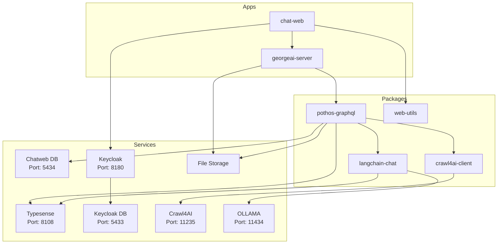

# George AI Project

## Getting Started

### 1. Re-open the repository in a **DevContainer**.

- DevContainers likely to have issues on Windows machines.

---

### 2. `.env` files:

- you need `.env` files in the directory you start the app from. If you start from **root**, setup `.env` file in the **root**, `pnpm dev` will start **george-ai** server on port `3003` and **chat-web** on `3001`. You can also start two of them separately, in this case you'd need to setup `.env` files in `apps/georgeai-server` and `apps/chat-web`.

- if you run prisma scripts in `packages/pothos-graphql` (ex. `pnpm prisma generate`), you need to setup `.env` file in it as well.

Use `env.example` files as the references.

---

### 3. Ports Overview

- **Port 3003**: GraphQL backend
- **Port 5432**: George-Ai DB
- **Port 3001**: Frontend
- **Port 11235**: crawl4ai
- **Port 8180**: keycloak
- **Port 5433**: keycloak DB
- **Port 8108**: typesense

**Vite** provides Hot Module Replacement (HMR) by establishing a WebSocket connection between the browser and the dev server. The **Vite** dev server automatically starts an HTTP server and creates a **WebSocket (WS)** server on the same host but with a dynamically assigned port. We enhance this setup with a custom **Vite** plugin that extracts the HMR WebSocket port and writes it to **app.config.ts** and an automatic port opening based on VSCode settings.

---

### 4. Set Up Keycloak

1. Open `http://localhost:8180` in your browser and log in using the credentials:
   - **Username:** `admin`
   - **Password:** `admin`

2. Create a new Realm using the value of `KEYCLOAK_REALM` from your `.env` file.

3. In the left sidebar, click **Clients** and then click **Create Client**.
   Use the value of `KEYCLOAK_CLIENT_ID` from your `.env` file as the **Client ID**.

   Add the following URLs to the fields below:
   - **Valid Redirect URIs:**
     `http://localhost:3001`,
     `http://localhost:3001/*`
   - **Valid Post Logout Redirect URIs:**
     `http://localhost:3001`,
     `http://localhost:3001/*`
   - **Web Origins:**
     `http://localhost:3001`,
     `http://localhost:3001/*`

4. Navigate to the **Users** section and click **Add User**.
   Fill in the required fields, then click **Create** at the bottom of the form.

5. After the user is created:
   - Go to the **Credentials** tab, set a password, and ensure **Temporary** is set to **Off**.
   - Go to the **Details** tab and provide:
     - **First Name**
     - **Last Name**
     - **Email**
     - Enable **Email Verified** by toggling the switch.

6. In the left sidebar, go to **Identity Providers**.
   Choose a provider (e.g., Google, GitHub, or OpenID Connect) and configure it using the required credentials (e.g., **Client ID** and **Client Secret**).

Docs for setting up an OAuth app in:

- Google: https://support.google.com/cloud/answer/6158849?hl=en
- GitHub: https://docs.github.com/en/apps/oauth-apps/building-oauth-apps/creating-an-oauth-app
- LinkedIn: https://techdocs.akamai.com/identity-cloud/docs/the-linkedin-oauth-20-social-login-configuration-guide

---

### 5. Migrate Database

Navigate to `packages/pothos-graphql` and run:

```bash
pnpm prisma migrate dev
```

---

### 6. Start Development

You can run the app from root using following command

```bash
pnpm dev
```

However, `georgeai-server` is not stable and breaks on file changes in Vite dev mode, so you would need to restart the backend server often. This will change in the future. As a temporary solution, open two separate terminal windows for `apps/georgeai-server` and `apps/chat-web` and run the command above in each.

Enjoy.

---

## Docker Build & Run Instructions

### Building Docker Images Locally

The project includes Dockerfiles for both the frontend (chat-web) and backend (georgeai-server) applications. Both images must be built from the **root directory** to ensure all monorepo dependencies are included in the build context.

#### Prerequisites

- Docker installed on your machine
- `.env` files configured (see section 2 above)

#### Build Commands

From the root directory of the project:

```bash
# Build the frontend (chat-web) image
docker build -f apps/chat-web/Dockerfile -t george-ai-frontend:local .

# Build the backend (georgeai-server) image
docker build -f apps/georgeai-server/Dockerfile -t george-ai-backend:local .

# Optional: Build with commit SHA for version tracking
docker build -f apps/chat-web/Dockerfile \
  --build-arg GIT_COMMIT_SHA=$(git rev-parse HEAD) \
  -t george-ai-frontend:local .

docker build -f apps/georgeai-server/Dockerfile \
  --build-arg GIT_COMMIT_SHA=$(git rev-parse HEAD) \
  -t george-ai-backend:local .
```

### Running Docker Containers Locally

Before running the containers, ensure that:

1. The required services (PostgreSQL, Keycloak, Typesense) are running (via DevContainer or docker-compose)
2. Database migrations have been applied (see section 5 above)

#### Run Frontend Container

```bash
docker run -d \
  --name george-ai-frontend \
  -p 3001:3000 \
  --env-file .env \
  --network host \
  george-ai-frontend:local
```

#### Run Backend Container

```bash
docker run -d \
  --name george-ai-backend \
  -p 3003:3003 \
  --env-file .env \
  --network host \
  george-ai-backend:local
```

**Note:** Using `--network host` allows containers to communicate with services running on localhost (useful for development). For production, use proper Docker networks.

### Docker Compose Setup (Alternative)

Create a `docker-compose.local.yml` file for easier local testing:

```yaml
version: '3.8'

services:
  frontend:
    image: george-ai-frontend:local
    ports:
      - '3001:3000'
    env_file:
      - .env
    depends_on:
      - backend
    networks:
      - george-ai-network

  backend:
    image: george-ai-backend:local
    ports:
      - '3003:3003'
    env_file:
      - .env
    networks:
      - george-ai-network

networks:
  george-ai-network:
    external: true # Assumes you have created this network for your services
```

Then run:

```bash
# Create the network (first time only)
docker network create george-ai-network

# Start both containers
docker-compose -f docker-compose.local.yml up -d

# View logs
docker-compose -f docker-compose.local.yml logs -f

# Stop containers
docker-compose -f docker-compose.local.yml down
```

### Testing the Build

To verify that the Docker build works correctly without running the containers:

```bash
# Test frontend build
docker build -f apps/chat-web/Dockerfile -t test-frontend:latest . && \
  echo "✅ Frontend build successful"

# Test backend build
docker build -f apps/georgeai-server/Dockerfile -t test-backend:latest . && \
  echo "✅ Backend build successful"

# Clean up test images
docker rmi test-frontend:latest test-backend:latest
```

### CI/CD Integration

The GitHub workflow at `.github/workflows/build-publish-dockers.yml` automatically builds and publishes Docker images to GitHub Container Registry (ghcr.io) on pushes to main. The same build context (root directory) is used in CI/CD as in local builds.

### Troubleshooting

**Common Issues:**

1. **Build fails with "package not found"**: Ensure you're building from the root directory, not from within the apps folders
2. **Container can't connect to services**: Check that services are accessible and `.env` variables are correctly set
3. **Permission errors**: The frontend runs as user `vinxi` (uid 1001), ensure mounted volumes have appropriate permissions
4. **Out of memory during build**: Increase Docker's memory allocation in Docker Desktop settings

**Debug Commands:**

```bash
# Check container logs
docker logs george-ai-frontend
docker logs george-ai-backend

# Access container shell for debugging
docker exec -it george-ai-frontend sh
docker exec -it george-ai-backend sh

# Check environment variables inside container
docker exec george-ai-frontend printenv | grep -E "(BACKEND_URL|KEYCLOAK|DATABASE)"
```

# Architecture



## Components

- **LLM Service** 🛠️
  - on backend service
  - consists of three components: GraphQL Endpoint, PDF Processor, Chains
- **GraphQL Endpoint** 🌐
  - communication endpoint of the LLM Service
- **PDF Processor** 📄
  - processes the uploaded PDFs
  - extracts the text and embeddings
  - writes the extracted data and the embedding to the LLM Database
- **Chains** 🔗
  - uses the embeddings in LLM Database as a retriever
  - contains the chains for chatbot and travel planner
- **LLM Database** 🗃️
  - stores the extracted data and embeddings
  - must be database with vector search support
- **Frontend** 💻
  - one Frontend App with two routes: Chatbot and Travel Planner
- **Chatbot** 🤖
  - bot to chat about the PDFs
