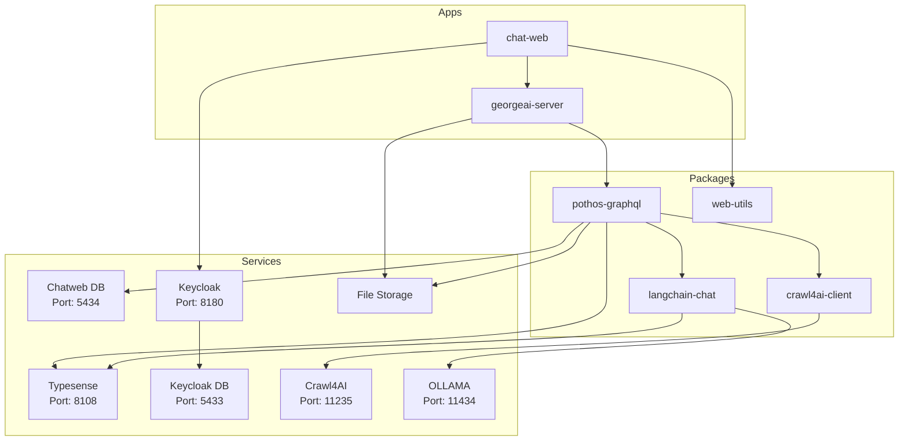

# George AI Project

## Documentation

- [Changelog](CHANGELOG.md) - See what's new in each release
- Changelog is also available in deployed applications at `/CHANGELOG.md`

## Getting Started

### 1. Re-open the repository in a **DevContainer**.

- DevContainers likely to have issues on Windows machines.

---

### 2. `.env` files:

- you need `.env` files in the directory you start the app from. If you start from **root**, setup `.env` file in the **root**, `pnpm dev` will start **george-ai** server on port `3003` and **chat-web** on `3001`. You can also start two of them separately, in this case you'd need to setup `.env` files in `apps/georgeai-server` and `apps/chat-web`.

- if you run prisma scripts in `packages/pothos-graphql` (ex. `pnpm prisma generate`), you need to setup `.env` file in it as well.

Use `env.example` files as the references.

---

### 3. Ports Overview

- **Port 3003**: GraphQL backend
- **Port 5432**: George-Ai DB
- **Port 3001**: Frontend
- **Port 11235**: crawl4ai
- **Port 8180**: keycloak
- **Port 5433**: keycloak DB
- **Port 8108**: typesense

**Vite** provides Hot Module Replacement (HMR) by establishing a WebSocket connection between the browser and the dev server. The **Vite** dev server automatically starts an HTTP server and creates a **WebSocket (WS)** server on the same host but with a dynamically assigned port. We enhance this setup with a custom **Vite** plugin that extracts the HMR WebSocket port and writes it to **app.config.ts** and an automatic port opening based on VSCode settings.

---

### 4. Set Up Keycloak

1. Open `http://localhost:8180` in your browser and log in using the credentials:
   - **Username:** `admin`
   - **Password:** `admin`

2. Create a new Realm using the value of `KEYCLOAK_REALM` from your `.env` file.

3. In the left sidebar, click **Clients** and then click **Create Client**.
   Use the value of `KEYCLOAK_CLIENT_ID` from your `.env` file as the **Client ID**.

   Add the following URLs to the fields below:
   - **Valid Redirect URIs:**
     `http://localhost:3001`,
     `http://localhost:3001/*`
   - **Valid Post Logout Redirect URIs:**
     `http://localhost:3001`,
     `http://localhost:3001/*`
   - **Web Origins:**
     `http://localhost:3001`,
     `http://localhost:3001/*`

4. Navigate to the **Users** section and click **Add User**.
   Fill in the required fields, then click **Create** at the bottom of the form.

5. After the user is created:
   - Go to the **Credentials** tab, set a password, and ensure **Temporary** is set to **Off**.
   - Go to the **Details** tab and provide:
     - **First Name**
     - **Last Name**
     - **Email**
     - Enable **Email Verified** by toggling the switch.

6. In the left sidebar, go to **Identity Providers**.
   Choose a provider (e.g., Google, GitHub, or OpenID Connect) and configure it using the required credentials (e.g., **Client ID** and **Client Secret**).

Docs for setting up an OAuth app in:

- Google: https://support.google.com/cloud/answer/6158849?hl=en
- GitHub: https://docs.github.com/en/apps/oauth-apps/building-oauth-apps/creating-an-oauth-app
- LinkedIn: https://techdocs.akamai.com/identity-cloud/docs/the-linkedin-oauth-20-social-login-configuration-guide

---

### 5. Migrate Database

Navigate to `packages/pothos-graphql` and run:

```bash
pnpm prisma migrate dev
```

---

### 6. Start Development

You can run the app from root using following command

```bash
pnpm dev
```

However, `georgeai-server` is not stable and breaks on file changes in Vite dev mode, so you would need to restart the backend server often. This will change in the future. As a temporary solution, open two separate terminal windows for `apps/georgeai-server` and `apps/chat-web` and run the command above in each.

Enjoy.

---

## Docker Build & Run Instructions

### Building and Running with Docker Compose

The project includes a `docker-compose.verify.yml` file to verify the Docker builds for both frontend and backend applications. This compose file builds only the frontend and backend containers and connects them to the existing **devcontainer services** (databases, Keycloak, Typesense).

#### Prerequisites

- Docker and Docker Compose installed on your machine
- **Devcontainer must be running** (with all services: databases, Keycloak, Typesense)
- Ensure ports 3002 and 3004 are available

#### Starting the Verify Services

From the root directory of the project:

```bash
# Build and start both frontend and backend
docker compose -f docker-compose.verify.yml up --build

# Or run in detached mode
docker compose -f docker-compose.verify.yml up --build -d

# Start only the backend
docker compose -f docker-compose.verify.yml up --build gai-verify-backend

# Start only the frontend (requires backend to be running)
docker compose -f docker-compose.verify.yml up --build gai-verify-frontend

# Start services separately in detached mode
docker compose -f docker-compose.verify.yml up --build -d gai-verify-backend
docker compose -f docker-compose.verify.yml up --build -d gai-verify-frontend
```

This will:

1. Build the frontend and backend Docker images with runtime configuration support
2. Connect backend to devcontainer services via Docker network:
   - PostgreSQL (`gai-chatweb-db`)
   - Typesense (`gai-typesense`)
   - Keycloak (`gai-keycloak`)
3. Start the backend server (with automatic database migrations)
4. Start the frontend application with runtime environment configuration

#### Accessing the Services

Once all services are running:

- **Verify Frontend**: http://localhost:3002
- **Verify Backend GraphQL**: http://localhost:3004/graphql
- **Devcontainer Keycloak**: http://localhost:8180 (shared with devcontainer)

#### Verifying the Build

To verify that the Docker builds work correctly without running them:

```bash
# Build both images without starting containers
docker compose -f docker-compose.verify.yml build

# If successful, you'll see:
# ✅ Successfully built frontend and backend images
```

**Important Notes:**

- The verify containers connect to the devcontainer Docker network (`george-ai_devcontainer_default`)
- They communicate with devcontainer services using container names:
  - Database: `gai-chatweb-db`
  - Typesense: `gai-typesense`
  - Keycloak: `gai-keycloak`
- Port mappings avoid conflicts with devcontainer:
  - Verify frontend: 3002 (instead of 3001)
  - Verify backend: 3004 (instead of 3003)
- You can run both devcontainer apps and verify containers simultaneously for comparison

#### Stopping and Cleaning Up

```bash
# Stop all services
docker compose -f docker-compose.verify.yml down

# Stop and remove all data volumes (clean slate)
docker compose -f docker-compose.verify.yml down -v

# Remove built images as well
docker compose -f docker-compose.verify.yml down --rmi all -v
```

#### Viewing Logs

```bash
# View logs from all services
docker compose -f docker-compose.verify.yml logs

# View logs from specific service
docker compose -f docker-compose.verify.yml logs gai-verify-frontend
docker compose -f docker-compose.verify.yml logs gai-verify-backend

# Follow logs in real-time
docker compose -f docker-compose.verify.yml logs -f
```

### Building Individual Docker Images

If you need to build images separately (e.g., for CI/CD), both images must be built from the **root directory** to ensure all monorepo dependencies are included:

```bash
# Build the frontend (chat-web) image
docker build -f apps/chat-web/Dockerfile -t george-ai-frontend:local .

# Build the backend (georgeai-server) image
docker build -f apps/georgeai-server/Dockerfile -t george-ai-backend:local .
```

### Runtime Configuration for Multi-Tenant Deployments

The Docker images are built with **runtime configuration** support, allowing a single image to be deployed to multiple customer environments with different configuration values.

**How it works:**

1. **Build Time**: Images are built without any environment-specific values baked in
2. **Runtime**: Configuration is provided via environment variables when containers start
3. **Server Function**: The frontend could use use server function to fetch configuration at runtime

**Key Environment Variables:**

Frontend runtime configuration should use server functions to get access to:

- `BACKEND_URL` - Internal backend URL for server-side requests
- `BACKEND_PUBLIC_URL` - Public backend URL for client-side requests
- `KEYCLOAK_URL` - Keycloak server URL (must be external/public)
- `KEYCLOAK_REALM` - Keycloak realm name
- `KEYCLOAK_CLIENT_ID` - Keycloak client ID
- `KEYCLOAK_REDIRECT_URL` - Frontend redirect URL
- `PUBLIC_APP_URL` - Public frontend URL
- `GIT_COMMIT_SHA` - Git commit hash for version tracking

This approach enables:

- ✅ Single Docker image for all customer environments
- ✅ Different URLs/configuration per deployment
- ✅ No rebuild needed for configuration changes
- ✅ Simplified CI/CD pipeline

### CI/CD Integration

The GitHub workflow at `.github/workflows/build-publish-dockers.yml` automatically builds and publishes Docker images to GitHub Container Registry (ghcr.io) on pushes to main. The same build context (root directory) is used in CI/CD as in local builds.

Images are built once and can be deployed to multiple environments by providing different environment variables at deployment time.

### Troubleshooting

**Common Issues:**

1. **Build fails with "package not found"**: Ensure you're building from the root directory, not from within the apps folders
2. **Container can't connect to services**: Check that services are accessible and `.env` variables are correctly set
3. **Permission errors**: The frontend runs as user `vinxi` (uid 1001), ensure mounted volumes have appropriate permissions
4. **Out of memory during build**: Increase Docker's memory allocation in Docker Desktop settings

**Debug Commands:**

```bash
# Check container logs
docker logs gai-verify-frontend
docker logs gai-verify-backend

# Access container shell for debugging
docker exec -it gai-verify-frontend sh
docker exec -it gai-verify-backend sh

# Check environment variables inside container
docker exec gai-verify-frontend printenv | grep -E "(BACKEND_URL|KEYCLOAK|DATABASE)"
```

# Architecture



## Components

- **LLM Service** 🛠️
  - on backend service
  - consists of three components: GraphQL Endpoint, PDF Processor, Chains
- **GraphQL Endpoint** 🌐
  - communication endpoint of the LLM Service
- **PDF Processor** 📄
  - processes the uploaded PDFs
  - extracts the text and embeddings
  - writes the extracted data and the embedding to the LLM Database
- **Chains** 🔗
  - uses the embeddings in LLM Database as a retriever
  - contains the chains for chatbot and travel planner
- **LLM Database** 🗃️
  - stores the extracted data and embeddings
  - must be database with vector search support
- **Frontend** 💻
  - one Frontend App with two routes: Chatbot and Travel Planner
- **Chatbot** 🤖
  - bot to chat about the PDFs
