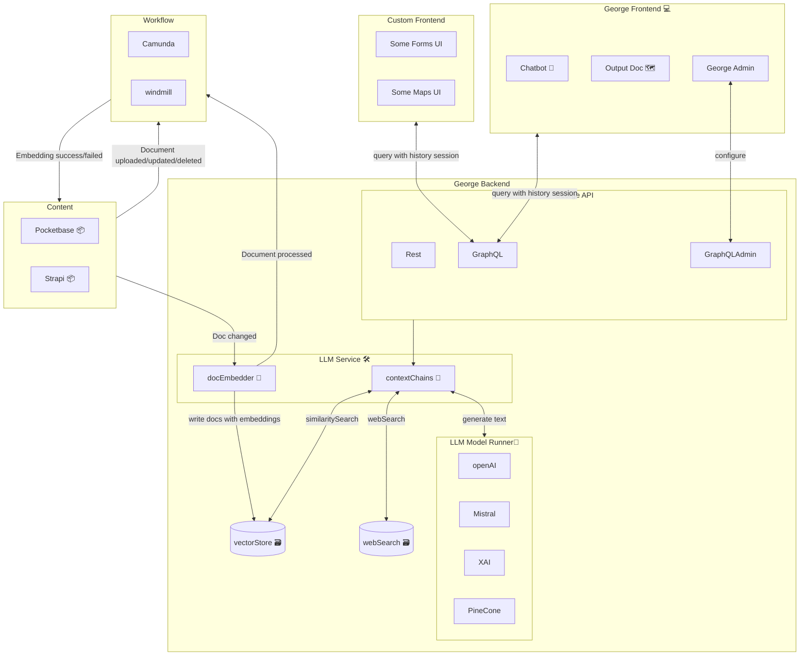

# George AI Project

you should start developing on it using VSCode devcontainers.

To start the george-web app you need to

- re-open in dev container
- create .env files in the root, `apps/chat-web`, `apps/georgeai-server` and `packages/pothos-graphql` following `env.example` files
- `pnpm dev`

Enjoy.

# Architecture

## Components

- **Pocketbase** 📦
  - used by the publisher
  - used for uploading PDFs
  - stores PDFs locally
  - it will inform the LLM Service about the uploaded PDFs
- **Pocketbase Database** 🗄️
  - stores Pocketbase data using sqlite
- **LLM Service** 🛠️
  - on backend service
  - consists of three components: GraphQL Endpoint, PDF Processor, Chains
- **GraphQL Endpoint** 🌐
  - communication endpoint of the LLM Service
- **PDF Processor** 📄
  - processes the uploaded PDFs
  - extracts the text and embeddings
  - writes the extracted data and the embedding to the LLM Database
  - informs Pocketbase that the PDF has been processed
- **Chains** 🔗
  - uses the embeddings in LLM Database as a retriever
  - contains the chains for chatbot and travel planner
- **LLM Database** 🗃️
  - stores the extracted data and embeddings
  - must be database with vector search support
- **Frontend** 💻
  - one Frontend App with two routes: Chatbot and Travel Planner
- **Chatbot** 🤖
  - bot to chat about the PDFs
- **Travel Planner** 🗺️
  - to create travel plans based on the PDFs
