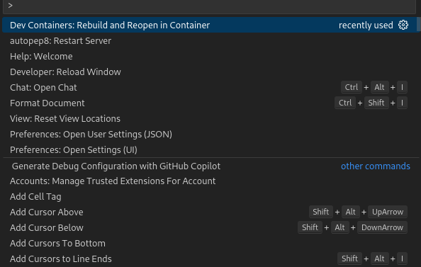

# George AI Project

Welcome to the **George AI Project**!

## Table of Contents

- [George AI Project](#george-ai-project)
  - [Table of Contents](#table-of-contents)
  - [Prerequisites](#prerequisites)
  - [Getting Started](#getting-started)
    - [Clone and Install Dependencies](#clone-and-install-dependencies)
    - [Install Docker](#install-docker)
      - [Installing on Debian](#installing-on-debian)
    - [Running the Server and Chat Interface](#running-the-server-and-chat-interface)
      - [Start the Server](#start-the-server)
      - [Start the Chat Interface](#start-the-chat-interface)
      - [Sending Messages via GraphiQL](#sending-messages-via-graphiql)
  - [Modifying the Chat Bot Agent](#modifying-the-chat-bot-agent)

---

## Prerequisites

Before you begin, ensure you have the following installed:

- **Node.js**: Version 20 or later.
- **Yarn**: Used as the package manager for this project.
- **Docker**: Version 17.12.0 or later.
- **VS Code Extensions**:
  - [Remote - Containers](https://marketplace.visualstudio.com/items?itemName=ms-vscode-remote.remote-containers)
  - [Remote - SSH](https://marketplace.visualstudio.com/items?itemName=ms-vscode-remote.remote-ssh)

---

## Getting Started

### Clone and Install Dependencies

1. Clone the repository:

   ```bash
   git clone https://github.com/progwise/george-ai.git
   ```

2. Navigate to the server directory:

   ```bash
   cd apps/georgeai-server
   mv .env.example .env
   ```

3. Fill the `.env` file with the required API keys.

4. Return to the root folder and install dependencies:
   ```bash
   cd $(git rev-parse --show-toplevel)
   yarn
   ```

---

### Install Docker

#### Installing on Debian

To install Docker on Debian, follow the [official Docker documentation](https://docs.docker.com/desktop/setup/install/linux/debian/).

Once Docker is installed, open VS Code and:

1. Press `Ctrl + Shift + P`.
2. Select **Dev Container: Rebuild and Reopen in Container**, similar to the example below:

   

---

### Running the Server and Chat Interface

#### Start the Server

1. Navigate to the server directory:

   ```bash
   cd apps/georgeai-server
   ```

2. Install dependencies and start the server:

   ```bash
   yarn
   yarn start
   ```

3. Visit `http://localhost:3000` to verify the server is running.

#### Start the Chat Interface

1. Navigate to the chat interface directory:

   ```bash
   cd $(git rev-parse --show-toplevel)/apps/chat-web
   ```

2. Install dependencies and start the development server:

   ```bash
   yarn
   yarn dev
   ```

3. Visit `http://localhost:3001` to interact with the chat interface.

#### Sending Messages via GraphiQL

To send messages using the GraphiQL interface, use the following mutation:

```graphql
mutation {
  chat(question: "What can I do in Greifswald?", sessionId: "v1") {
    answer
    source
  }
}
```

---

## Modifying the Chat Bot Agent

To modify the chatbot agent logic, navigate to the source code directory:

```bash
cd $(git rev-parse --show-toplevel)/packages/langchain-chat/src
```

Here, you will find the following TypeScript files:

```plaintext
.
├── index.ts
├── main-chain.ts
├── message-history.ts
├── pdf-vectorstore.ts
├── prompts.ts
└── web-vectorstore.ts
```
