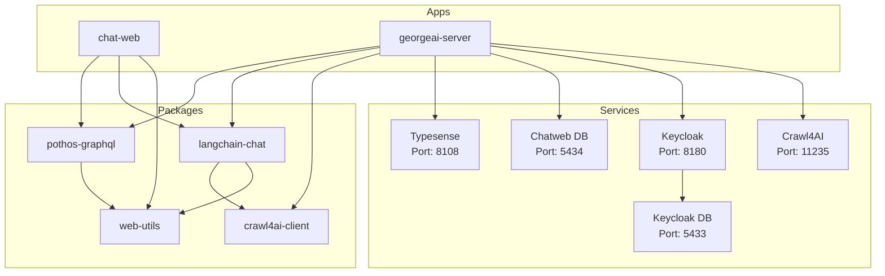

# George AI Project

## Getting Started

### 1. Re-open the repository in a **DevContainer**.

- DevContainers likely to have issues on Windows machines.

---

### 2. `.env` files:

- you need `.env` files in the directory you start the app from. If you start from **root**, setup `.env` file in the **root**, `pnpm dev` will start **george-ai** server on port `3003` and **chat-web** on `3001`. You can also start two of them separately, in this case you'd need to setup `.env` files in `apps/georgeai-server` and `apps/chat-web`.

- if you run prisma scripts in `packages/pothos-graphql` (ex. `pnpm prisma generate`), you need to setup `.env` file in it as well.

Use `env.example` files as the references.

---

### 3. Ports Overview

- **Port 3003**: GraphQL backend
- **Port 5432**: George-Ai DB
- **Port 3001**: Frontend
- **Port 11235**: crawl4ai
- **Port 8180**: keycloak
- **Port 5433**: keycloak DB
- **Port 8108**: typesense

**Vite** provides Hot Module Replacement (HMR) by establishing a WebSocket connection between the browser and the dev server. The **Vite** dev server automatically starts an HTTP server and creates a **WebSocket (WS)** server on the same host but with a dynamically assigned port. We enhance this setup with a custom **Vite** plugin that extracts the HMR WebSocket port and writes it to **app.config.ts** and an automatic port opening based on VSCode settings.

---

### 4. Set Up Keycloak

1. Open `http://localhost:8180` in your browser and log in using the credentials:

   - **Username:** `admin`
   - **Password:** `admin`

2. Create a new Realm using the value of `KEYCLOAK_REALM` from your `.env` file.

3. In the left sidebar, click **Clients** and then click **Create Client**.
   Use the value of `KEYCLOAK_CLIENT_ID` from your `.env` file as the **Client ID**.

   Add the following URLs to the fields below:

   - **Valid Redirect URIs:**
     `http://localhost:3001`,
     `http://localhost:3001/*`
   - **Valid Post Logout Redirect URIs:**
     `http://localhost:3001`,
     `http://localhost:3001/*`
   - **Web Origins:**
     `http://localhost:3001`,
     `http://localhost:3001/*`

4. Navigate to the **Users** section and click **Add User**.
   Fill in the required fields, then click **Create** at the bottom of the form.

5. After the user is created:

   - Go to the **Credentials** tab, set a password, and ensure **Temporary** is set to **Off**.
   - Go to the **Details** tab and provide:
     - **First Name**
     - **Last Name**
     - **Email**
     - Enable **Email Verified** by toggling the switch.

6. In the left sidebar, go to **Identity Providers**.
   Choose a provider (e.g., Google, GitHub, or OpenID Connect) and configure it using the required credentials (e.g., **Client ID** and **Client Secret**).

Docs for setting up an OAuth app in:

- Google: https://support.google.com/cloud/answer/6158849?hl=en
- GitHub: https://docs.github.com/en/apps/oauth-apps/building-oauth-apps/creating-an-oauth-app
- LinkedIn: https://techdocs.akamai.com/identity-cloud/docs/the-linkedin-oauth-20-social-login-configuration-guide

---

### 5. Migrate Database

Navigate to `packages/pothos-graphql` and run:

```bash
pnpm prisma migrate dev
```

---

### 7. Start Development

You can run the app from root using following command

```bash
pnpm dev
```

However, `georgeai-server` is not stable and breaks on file changes in Vite dev mode, so you would need to restart the backend server often. This will change in the future. As a temporary solution, open two separate terminal windows for `apps/georgeai-server` and `apps/chat-web` and run the command above in each.

Enjoy.

# Architecture



## Components

- **LLM Service** 🛠️
  - on backend service
  - consists of three components: GraphQL Endpoint, PDF Processor, Chains
- **GraphQL Endpoint** 🌐
  - communication endpoint of the LLM Service
- **PDF Processor** 📄
  - processes the uploaded PDFs
  - extracts the text and embeddings
  - writes the extracted data and the embedding to the LLM Database
- **Chains** 🔗
  - uses the embeddings in LLM Database as a retriever
  - contains the chains for chatbot and travel planner
- **LLM Database** 🗃️
  - stores the extracted data and embeddings
  - must be database with vector search support
- **Frontend** 💻
  - one Frontend App with two routes: Chatbot and Travel Planner
- **Chatbot** 🤖
  - bot to chat about the PDFs
- **Travel Planner** 🗺️
  - to create travel plans based on the PDFs

```

```
