# George AI Project

you should start developing on it using VSCode devcontainers.

To start the george-web app you need to

- re-open in dev container
- create .env files in the root, `apps/chat-web`, `apps/georgeai-server` and `packages/pothos-graphql` following `env.example` files
- we have a bash script, if you are new just ask for it to setup env files
- port 3003 is a GraphQL backend
- port 3001 for the front end
- steps for creating keycloak: go to 8180, admin admin, keycloak/master > create realm > info is in .env of chat-web (george-ai realm name, create), go to clients, create client, clientid in env (george-ai-web), next, next, valid redirect uri's, from env (http://localhost:3001 and http://localhost:3001/\*), save, same links for Valid post logout redirect URIs and Web Origins, create new user, create credentials
- cd packages/pothos-graphql, pnpm prisma db push
- download georgesetenv
- create pocketbase token
- http://localhost:8090/\_
- create user by going into the gai-pocketbase docker container
- Launch the URL below in the browser if it hasn't been open already to create your first superuser account:
- system, superusers, impersonate to create an auth token
- `pnpm dev`

Enjoy.

# Architecture

```mermaid
flowchart TD


  content -- Document uploaded/updated/deleted--> workflow
  workflow -- Embedding success/failed --> content
  docEmbedder -- Document processed--> workflow
  content -- Doc changed --> docEmbedder

  subgraph georgeFrontend[George Frontend 💻]
    chatbot[Chatbot 🤖]
    docGenerator[Output Doc 🗺️]
    georgeAdmin[George Admin]
  end

  subgraph otherFrontend[Custom Frontend]
    formProvider[Some Forms UI]
    mapProvider[Some Maps UI]
  end

  subgraph backend[George Backend]
    subgraph georgeAPI [George API]
      restApi[Rest]
      graphqlAPI[GraphQL]
      graphqlAdminAPI[GraphQLAdmin]
    end

    webSearch[(webSearch 🗃️)]
    vectorStore[(vectorStore 🗃️)]

    subgraph llmService[LLM Service 🛠️]
      docEmbedder[docEmbedder 📄]
      contextChains[contextChains 🔗]
    end

    georgeAPI --> contextChains


    docEmbedder -- write docs with embeddings --> vectorStore
    contextChains <-- similaritySearch --> vectorStore
    contextChains <-- webSearch --> webSearch
    subgraph model[LLM Model Runner🤖]
      openAI[openAI]
      mistral[Mistral]
      xai[XAI]
      pineCone[PineCone]
    end

  end
  subgraph content[Content]
      pocketbase[Pocketbase 📦]
      strapi[Strapi 📦]
    end

  subgraph workflow[Workflow]
    camunda[Camunda]
    windmill[windmill]

  end

  contextChains <-- generate text --> model
  georgeFrontend <-- query with history session --> graphqlAPI
  otherFrontend <-- query with history session --> graphqlAPI
  georgeAdmin <-- configure --> graphqlAdminAPI
```

## Components

- **Pocketbase** 📦
  - used by the publisher
  - used for uploading PDFs
  - stores PDFs locally
  - it will inform the LLM Service about the uploaded PDFs
- **Pocketbase Database** 🗄️
  - stores Pocketbase data using sqlite
- **LLM Service** 🛠️
  - on backend service
  - consists of three components: GraphQL Endpoint, PDF Processor, Chains
- **GraphQL Endpoint** 🌐
  - communication endpoint of the LLM Service
- **PDF Processor** 📄
  - processes the uploaded PDFs
  - extracts the text and embeddings
  - writes the extracted data and the embedding to the LLM Database
  - informs Pocketbase that the PDF has been processed
- **Chains** 🔗
  - uses the embeddings in LLM Database as a retriever
  - contains the chains for chatbot and travel planner
- **LLM Database** 🗃️
  - stores the extracted data and embeddings
  - must be database with vector search support
- **Frontend** 💻
  - one Frontend App with two routes: Chatbot and Travel Planner
- **Chatbot** 🤖
  - bot to chat about the PDFs
- **Travel Planner** 🗺️
  - to create travel plans based on the PDFs
