# George AI Project

## Getting Started

### 1. Re-open the repository in a **DevContainer**.

---

### 2. Create `.env` Files in:

- **Root directory**
- `apps/chat-web`
- `apps/georgeai-server`
- `packages/pothos-graphql`

Use `env.example` files as references.

---

### 3. Ports Overview

- **Port 3003**: GraphQL backend
- **Port 3001**: Frontend

---

### 4. Set Up Keycloak

1. Navigate to `http://localhost:8180` and log in with the credentials `admin` and `admin`.
2. Create a Realm using `KEYCLOAK_REALM` from `.env` file.
3. Set **Client ID** from `KEYCLOAK_CLIENT_ID`.
4. Add `http://localhost:3001` and `http://localhost:3001/*` to Valid Redirect URIs, Valid Post Logout Redirect URIs and Web Origins.
5. Go to the **Users** section and create a user and set a password under the **Credentials** tab in the user view.

---

### 5. Push Prisma Schema

Navigate to `packages/pothos-graphql` and run:

```bash
pnpm prisma db push
```

---

### 6. Create PocketBase Token

Under `gai-pocketbase` container within the `george-ai_devcontainer`, replace `0.0.0.0` with `localhost` in the link and paste it into the browser.
Log in to PocketBase at `http://localhost:8090/_`, navigate to System > \_superusers, click on your user, and:

- Click the three dots → Choose Impersonate → Generate a token.
- Copy the token and add it to your .env file.

---

### 7. Start Development

Open two separate terminal windows for `apps/georgeai-server` and `apps/chat-web` and run the following command in each:

```bash
pnpm dev
```

Enjoy.

# Architecture

```mermaid
flowchart TD


  content -- Document uploaded/updated/deleted--> workflow
  workflow -- Embedding success/failed --> content
  docEmbedder -- Document processed--> workflow
  content -- Doc changed --> docEmbedder

  subgraph georgeFrontend[George Frontend 💻]
    chatbot[Chatbot 🤖]
    docGenerator[Output Doc 🗺️]
    georgeAdmin[George Admin]
  end

  subgraph otherFrontend[Custom Frontend]
    formProvider[Some Forms UI]
    mapProvider[Some Maps UI]
  end

  subgraph backend[George Backend]
    subgraph georgeAPI [George API]
      restApi[Rest]
      graphqlAPI[GraphQL]
      graphqlAdminAPI[GraphQLAdmin]
    end

    webSearch[(webSearch 🗃️)]
    vectorStore[(vectorStore 🗃️)]

    subgraph llmService[LLM Service 🛠️]
      docEmbedder[docEmbedder 📄]
      contextChains[contextChains 🔗]
    end

    georgeAPI --> contextChains


    docEmbedder -- write docs with embeddings --> vectorStore
    contextChains <-- similaritySearch --> vectorStore
    contextChains <-- webSearch --> webSearch
    subgraph model[LLM Model Runner🤖]
      openAI[openAI]
      mistral[Mistral]
      xai[XAI]
      pineCone[PineCone]
    end

  end
  subgraph content[Content]
      pocketbase[Pocketbase 📦]
      strapi[Strapi 📦]
    end

  subgraph workflow[Workflow]
    camunda[Camunda]
    windmill[windmill]

  end

  contextChains <-- generate text --> model
  georgeFrontend <-- query with history session --> graphqlAPI
  otherFrontend <-- query with history session --> graphqlAPI
  georgeAdmin <-- configure --> graphqlAdminAPI
```



## Components

- **Pocketbase** 📦
  - used by the publisher
  - used for uploading PDFs
  - stores PDFs locally
  - it will inform the LLM Service about the uploaded PDFs
- **Pocketbase Database** 🗄️
  - stores Pocketbase data using sqlite
- **LLM Service** 🛠️
  - on backend service
  - consists of three components: GraphQL Endpoint, PDF Processor, Chains
- **GraphQL Endpoint** 🌐
  - communication endpoint of the LLM Service
- **PDF Processor** 📄
  - processes the uploaded PDFs
  - extracts the text and embeddings
  - writes the extracted data and the embedding to the LLM Database
  - informs Pocketbase that the PDF has been processed
- **Chains** 🔗
  - uses the embeddings in LLM Database as a retriever
  - contains the chains for chatbot and travel planner
- **LLM Database** 🗃️
  - stores the extracted data and embeddings
  - must be database with vector search support
- **Frontend** 💻
  - one Frontend App with two routes: Chatbot and Travel Planner
- **Chatbot** 🤖
  - bot to chat about the PDFs
- **Travel Planner** 🗺️
  - to create travel plans based on the PDFs
