# George AI Project

## Getting Started

### 1. Re-open the repository in a **DevContainer**.

- DevContainers likely to have issues on Windows machines.

---

### 2. `.env` files:

- you need `.env` files in the directory you start the app from. If you start from **root**, setup `.env` file in the **root**, `pnpm dev` will start **george-ai** server on port `3003` and **chat-web** on `3001`. You can also start two of them separately, in this case you'd need to setup `.env` files in `apps/georgeai-server` and `apps/chat-web`.

- if you run prisma scripts in `packages/pothos-graphql` (ex. `pnpm prisma generate`), you need to setup `.env` file in it as well.

Use `env.example` files as the references.

---

### 3. Ports Overview

- **Port 3003**: GraphQL backend
- **Port 3001**: Frontend

**Vite** provides Hot Module Replacement (HMR) by establishing a WebSocket connection between the browser and the dev server. The **Vite** dev server automatically starts an HTTP server and creates a **WebSocket (WS)** server on the same host but with a dynamically assigned port. We enhance this setup with a custom **Vite** plugin that extracts the HMR WebSocket port and writes it to **app.config.ts** and an automatic port opening based on VSCode settings.

---

### 4. Set Up Keycloak

1. Navigate to `http://localhost:8180` and log in with the credentials `admin` and `admin`.
2. Create a Realm using `KEYCLOAK_REALM` from `.env` file.
3. Set **Client ID** from `KEYCLOAK_CLIENT_ID`.
4. Add `http://localhost:3001` and `http://localhost:3001/*` to Valid Redirect URIs, Valid Post Logout Redirect URIs and Web Origins.
5. Navigate to the **Users** section and create a new user. Under the **Credentials** tab, set a password for the user. Then, go to the **Details** tab and provide the following information:

- **First Name**
- **Last Name**
- **Email Address**

Ensure the email address is marked as verified by toggling the **Email Verified** option.

6. Go to the **Identity Providers** section and select **Provider** (e.g., Google, GitHub, or OpenID Connect). Configure the provider with the required details (e.g.Client ID and Client Secret).

Client Authentication has to be **off**.

Docs for setting up an OAuth app in:

- Google: https://support.google.com/cloud/answer/6158849?hl=en
- GitHub: https://docs.github.com/en/apps/oauth-apps/building-oauth-apps/creating-an-oauth-app
- LinkedIn: https://techdocs.akamai.com/identity-cloud/docs/the-linkedin-oauth-20-social-login-configuration-guide

---

### 5. Push Prisma Schema

Navigate to `packages/pothos-graphql` and run:

```bash
pnpm prisma migrate dev
```

---

### 6. Create PocketBase Token

In order to upload files for George-AI to work with, you will need to setup **PocketBase**.

Under `gai-pocketbase` container within the `george-ai_devcontainer`, replace `0.0.0.0` with `localhost` in the link and paste it into the browser.
Log in to PocketBase at `http://localhost:8090/_`, navigate to System > \_superusers, click on your user, and:

- Click the three dots → Choose Impersonate → Generate a token.
- Copy **Impersonate auth token** and add it to your .env file as `POCKETBASE_TOKEN`.

---

### 7. Start Development

You can run the app from root using following command

```bash
pnpm dev
```

However, `georgeai-server` is not stable and breaks on file changes in Vite dev mode, so you would need to restart the backend server often. This will change in the future. As a temporary solution, open two separate terminal windows for `apps/georgeai-server` and `apps/chat-web` and run the command above in each.

Enjoy.

# Architecture

```mermaid
flowchart TD


  content -- Document uploaded/updated/deleted--> workflow
  workflow -- Embedding success/failed --> content
  docEmbedder -- Document processed--> workflow
  content -- Doc changed --> docEmbedder

  subgraph georgeFrontend[George Frontend 💻]
    chatbot[Chatbot 🤖]
    docGenerator[Output Doc 🗺️]
    georgeAdmin[George Admin]
  end

  subgraph otherFrontend[Custom Frontend]
    formProvider[Some Forms UI]
    mapProvider[Some Maps UI]
  end

  subgraph backend[George Backend]
    subgraph georgeAPI [George API]
      restApi[Rest]
      graphqlAPI[GraphQL]
      graphqlAdminAPI[GraphQLAdmin]
    end

    webSearch[(webSearch 🗃️)]
    vectorStore[(vectorStore 🗃️)]

    subgraph llmService[LLM Service 🛠️]
      docEmbedder[docEmbedder 📄]
      contextChains[contextChains 🔗]
    end

    georgeAPI --> contextChains


    docEmbedder -- write docs with embeddings --> vectorStore
    contextChains <-- similaritySearch --> vectorStore
    contextChains <-- webSearch --> webSearch
    subgraph model[LLM Model Runner🤖]
      openAI[openAI]
      mistral[Mistral]
      xai[XAI]
      pineCone[PineCone]
    end

  end
  subgraph content[Content]
      pocketbase[Pocketbase 📦]
      strapi[Strapi 📦]
    end

  subgraph workflow[Workflow]
    camunda[Camunda]
    windmill[windmill]

  end

  contextChains <-- generate text --> model
  georgeFrontend <-- query with history session --> graphqlAPI
  otherFrontend <-- query with history session --> graphqlAPI
  georgeAdmin <-- configure --> graphqlAdminAPI
```



## Components

- **Pocketbase** 📦
  - used by the publisher
  - used for uploading PDFs
  - stores PDFs locally
  - it will inform the LLM Service about the uploaded PDFs
- **Pocketbase Database** 🗄️
  - stores Pocketbase data using sqlite
- **LLM Service** 🛠️
  - on backend service
  - consists of three components: GraphQL Endpoint, PDF Processor, Chains
- **GraphQL Endpoint** 🌐
  - communication endpoint of the LLM Service
- **PDF Processor** 📄
  - processes the uploaded PDFs
  - extracts the text and embeddings
  - writes the extracted data and the embedding to the LLM Database
  - informs Pocketbase that the PDF has been processed
- **Chains** 🔗
  - uses the embeddings in LLM Database as a retriever
  - contains the chains for chatbot and travel planner
- **LLM Database** 🗃️
  - stores the extracted data and embeddings
  - must be database with vector search support
- **Frontend** 💻
  - one Frontend App with two routes: Chatbot and Travel Planner
- **Chatbot** 🤖
  - bot to chat about the PDFs
- **Travel Planner** 🗺️
  - to create travel plans based on the PDFs
