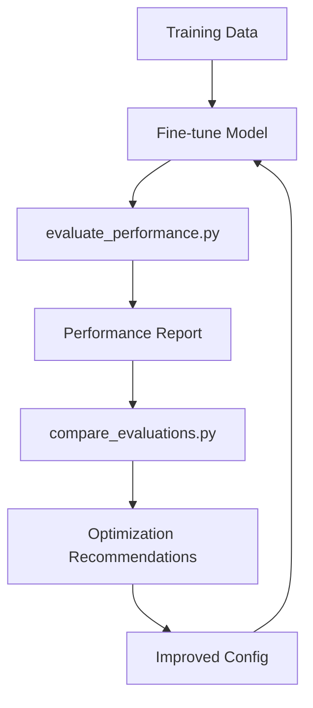

# 📊 Model Evaluation Documentation

This directory contains comprehensive documentation and tools for evaluating fine-tuned language model performance.

## 📚 Documentation Files

### 📖 **Main Guides**
- **[MODEL_EVALUATION_GUIDE.md](MODEL_EVALUATION_GUIDE.md)** - Complete evaluation methodology and best practices
- **[EVALUATION_QUICK_REFERENCE.md](EVALUATION_QUICK_REFERENCE.md)** - Quick command reference and troubleshooting
- **[improved_config_recommendations.md](improved_config_recommendations.md)** - Specific recommendations based on your analysis

### 🛠 **Evaluation Scripts**
- **[evaluate_performance.py](evaluate_performance.py)** - Main evaluation script for comparing models
- **[compare_evaluations.py](compare_evaluations.py)** - Compare multiple evaluation results
- **[finetune_ollama_config_qwen_improved.json](finetune_ollama_config_qwen_improved.json)** - Optimized training configuration

## 🚀 Quick Start

### 1. Run Basic Evaluation
```bash
# Evaluate your current model
python3 evaluate_performance.py --num-samples 30

# View results
ls -la evaluation_results/
```

### 2. Compare Multiple Models
```bash
# After running several evaluations
python3 compare_evaluations.py evaluation_results/
```

### 3. Improve Your Model
```bash
# Use the improved configuration
python3 auto_finetune_to_ollama.py finetune_ollama_config_qwen_improved.json

# Re-evaluate
python3 evaluate_performance.py --finetuned-model qwen2.5-coder-7b-verlag-v2
```

## 📊 Understanding Your Results

### Current Performance Status
Based on your evaluation:
- **Baseline Accuracy**: 7.1%
- **Fine-tuned Accuracy**: 15.4% 
- **Improvement**: +8.3% ✅

### Performance Interpretation
| Score Range | Status | Action |
|-------------|--------|--------|
| +20%+ | 🟢 Excellent | Deploy to production |
| +10-20% | 🟡 Good | Minor optimizations |
| +5-10% | 🟠 Moderate | **← You are here** |
| 0-5% | 🔴 Poor | Major improvements needed |

## 🎯 Your Next Steps

### High-Priority Actions
1. **✅ Use improved config** - Already created `finetune_ollama_config_qwen_improved.json`
2. **📊 Add more training data** - Expand from 333 to 500+ examples
3. **🔄 Re-train with better settings** - 3x more iterations, higher learning rate
4. **📈 Re-evaluate** - Track improvement trends

### Expected Results
With the recommended improvements, you should achieve:
- **Target accuracy**: 30-40% (vs current 15.4%)
- **Perfect matches**: 15-20% (vs current 0%)
- **Overall improvement**: +20-25% (vs current +8.3%)

## 📁 File Organization

```
fine-tuning/
├── evaluation_results/           # Generated evaluation reports
│   ├── evaluation_results_*.json
│   └── performance_report_*.md
├── evaluate_performance.py       # Main evaluation script
├── compare_evaluations.py        # Multi-model comparison
├── MODEL_EVALUATION_GUIDE.md     # Complete documentation
├── EVALUATION_QUICK_REFERENCE.md # Quick commands
└── improved_config_recommendations.md # Your specific recommendations
```

## 🔧 Tools Overview

### Evaluation Pipeline


### Key Scripts
- **`evaluate_performance.py`** - Core evaluation engine
- **`compare_evaluations.py`** - Multi-model analysis
- **Auto-generated reports** - Detailed performance breakdowns

## 📈 Monitoring Setup

### Regular Evaluation Schedule
```bash
# Weekly performance check
0 9 * * 1 cd /path/to/fine-tuning && python3 evaluate_performance.py --num-samples 50

# After each training run
python3 evaluate_performance.py --num-samples 100
```

### Performance Tracking
- Track improvement trends over time
- Monitor for performance regressions
- Compare different model configurations
- Identify optimal hyperparameters

## 🎓 Learning Resources

### Understanding Metrics
- **Similarity Score**: How close responses are to ground truth
- **Perfect Matches**: Exact correct answers
- **Good Matches**: Mostly correct (≥70% similarity)
- **Category Performance**: Breakdown by question type/difficulty

### Best Practices
- Use consistent test sets for fair comparison
- Balance sample sizes (30-100 for most cases)
- Monitor both accuracy and response quality
- Regular evaluation prevents performance drift

---

## 💡 Pro Tips

### 🎯 **Focus Areas for Your Model**
Based on your specific results:
1. **Domain knowledge expansion** - Add more PressCrafters context
2. **Training optimization** - Use the improved config provided
3. **Data quality** - Enhance with context-aware examples
4. **Regular monitoring** - Track improvement trends

### 🔍 **Debugging Performance Issues**
- Check individual model responses for quality
- Verify training data covers your use cases
- Monitor validation loss during training
- Compare with multiple baseline models

---

*This evaluation framework will help you systematically improve your fine-tuned models and track progress over time. Start with the quick reference and dive deeper into the full guide as needed.*
