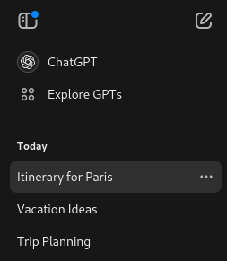
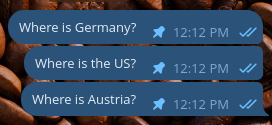
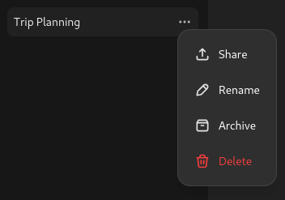

# Conversation Management Features

## 1. Users can list and reload their previous conversations and retrieve the full message history.

- Implemented using a **sidebar (drawer)** that displays all conversations.



## 2. Suggested UI for Branching

- **Timeline View:** Show **branching paths**.
- **Edit Previous Prompt:** Users can modify past questions.

Example UI (inspiration from ChatGPT):


## 3. Data schema for storing conversations and messages.

```prisma
model Conversation {
  id        String    @id @default(uuid())
  userId    String
  title     String?
  createdAt DateTime  @default(now())
  updatedAt DateTime  @updatedAt
  messages  Message[]
}

model Message {
  id              String       @id @default(uuid())
  conversationId  String
  conversation    Conversation @relation(fields: [conversationId], references: [id])
  parentMessageId String?
  sender          String       // 'user' or 'assistant'
  content         String
  createdAt       DateTime     @default(now())
  retrievalFlow   String?
  isPinned        Boolean      @default(false)
}
```

## 4. GraphQL queries and mutations for managing conversations and pinned messages.

```graphql
type Conversation {
  id: ID!
  userId: String!
  title: String
  messages: [Message!]!
  createdAt: DateTime
  updatedAt: DateTime
}

type Message {
  id: ID!
  conversationId: ID!
  parentMessageId: ID
  sender: String
  content: String
  retrievalFlow: String
  isPinned: Boolean
  createdAt: DateTime
}
```

---

# Further Ideas

## 5. Feedback on RetrievalFlow (data collection for further fine-tuning)

### **How to Improve AI Retrieval?**

- [ ] **A "RetrievalFlow Console" for transparency**.
- [ ] **Users can see how their queries were processed**.
- [ ] **Thumbs-up/down & comments for better AI fine-tuning**.


## 6. Pinned Messages Concept

### **6.1 Pinning Messages**

- Users can **pin messages** (from either user or assistant).
- **Pinned messages** will be stored in a **"Pinned" panel** for quick access.

#### **📝 UI Mockup**

- From `Telegram`:

  

## Users should be able to:

- Rename conversation title
- Soft delete conversation (archive)
- Share or export conversation


