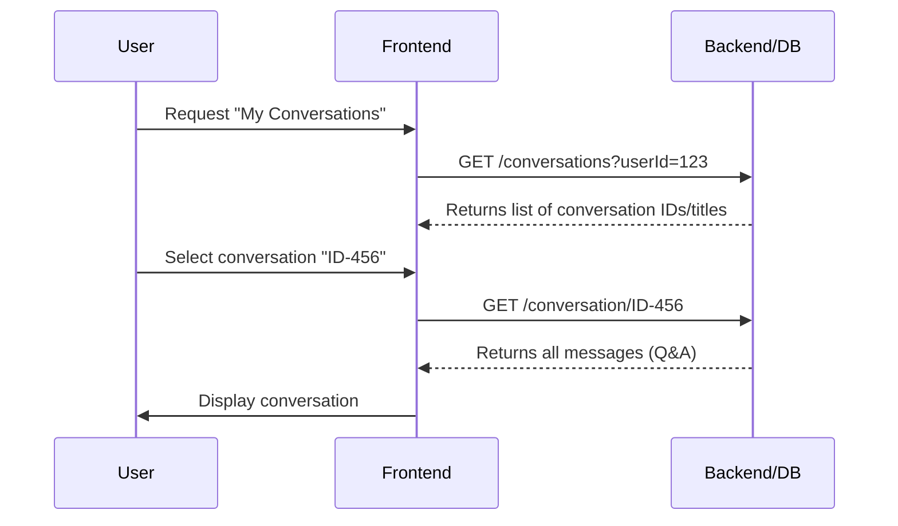
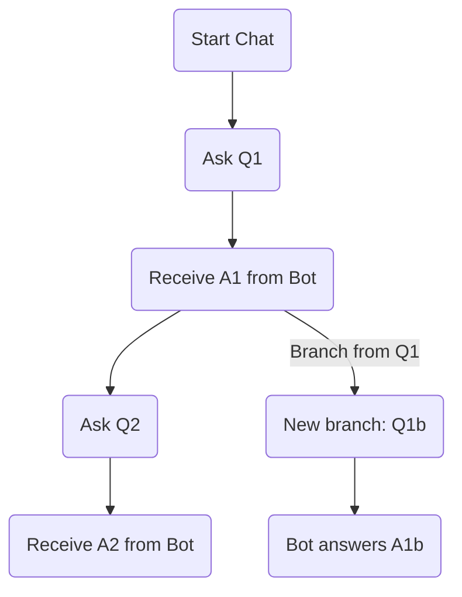

# **George-AI Assistant Enhancements with References**

This document expands on how to implement conversation branching, storing and listing user conversations, feedback for retrieval decisions, and more. It also includes **real-world** references to external docs and resources to help guide the implementation. In addition, we provide a **mermaid** diagram to illustrate conversation branching.

## **Table of Contents**

1. [Overview](#overview)
2. [Listing and Reloading Conversations](#listing-and-reloading)
3. [Conversation Branching](#conversation-branching)
4. [Feedback for RetrievalFlow](#feedback-for-retrievalflow)
5. [Sample Prisma Schema](#sample-prisma-schema)
6. [GraphQL Example](#graphql-example)
7. [UI Flow Diagram (Mermaid)](#ui-flow-diagram-mermaid)
8. [Useful Links](#useful-links)

---

## **1. Overview** <a name="overview"></a>

George-AI’s new features:

- **List** user conversations (with reload of Q&A).
- **Branch** a conversation at any message, so the user can explore different “threads” or directions.
- **Collect** feedback for the assistant’s retrieval decisions (local vs. web).
- **Internationalization (i18n)** with [react-i18next](https://react.i18next.com/).

---

## **2. Listing and Reloading Conversations** <a name="listing-and-reloading"></a>

1. **User** visits a “Conversations” page.
2. The backend **fetches** conversation metadata (titles, timestamps).
3. **User** selects a conversation to see all messages (questions & answers).
4. The UI **renders** them in chronological order.

**Example**:



---

## **3. Conversation Branching** <a name="conversation-branching"></a>

- **Fork** or **branch** from any past message.
- Creates a new chain of messages from that point onward, like Git branching.

**User Flow**:

1. The user hovers over a past message → clicks “Branch from here.”
2. The system **spawns** a new conversation record referencing that message as the “parent.”
3. The user’s future queries go to this new branch.

---

## **4. Feedback for RetrievalFlow** <a name="feedback-for-retrievalflow"></a>

- When **RetrievalFlow** chooses local or web, show a small “decision log.”
- Let the user rate or comment on each step: “This local PDF actually had enough info,” or “Found better results on web, but needed more context.”

This feedback can be stored for a future “RetrievalFlow configuration” improvement. Possibly a simple “thumbs up/down” or text comment.

---

## **5. Sample Prisma Schema** <a name="sample-prisma-schema"></a>

```prisma
model Conversation {
  id           String   @id @default(uuid())
  userId       String
  title        String?
  createdAt    DateTime @default(now())
  updatedAt    DateTime @updatedAt
  messages     Message[]
}

model Message {
  id              String       @id @default(uuid())
  conversationId  String
  conversation    Conversation @relation(fields: [conversationId], references: [id])
  parentMessageId String?
  sender          String       // 'user' or 'bot'
  content         String
  createdAt       DateTime     @default(now())
  retrievalFlow   String?
}
```

**References**:

- [Prisma Docs](https://www.prisma.io/docs/getting-started) for how to create & migrate the schema.

---

## **6. GraphQL Example** <a name="graphql-example"></a>

```graphql
type Conversation {
  id: ID!
  userId: String!
  title: String
  messages: [Message!]!
  createdAt: DateTime
  updatedAt: DateTime
}

type Message {
  id: ID!
  conversationId: ID!
  parentMessageId: ID
  sender: String
  content: String
  retrievalFlow: String
  createdAt: DateTime
}

type Query {
  conversations(userId: String!): [Conversation!]!
  conversation(id: ID!): Conversation
}

type Mutation {
  createConversation(userId: String!, title: String): Conversation!
  addMessage(
    conversationId: ID!
    parentMessageId: ID
    sender: String!
    content: String!
    retrievalFlow: String
  ): Message!
}
```

**References**:

- [Apollo GraphQL docs](https://www.apollographql.com/docs/apollo-server/getting-started)

---

## **7. UI Flow Diagram (Mermaid)** <a name="ui-flow-diagram-mermaid"></a>

Here’s a **conversation branching** illustration using Mermaid:



**Explanation**:

- After Q1 → A1, the user can proceed to Q2 or **branch** to Q1b.
- Each path forms a separate chain in the conversation data.

---

## **8. Useful Links** <a name="useful-links"></a>

- **[react-i18next Docs](https://react.i18next.com/)**: Official guide to implementing multi-language text in React.
- **[Mermaid Live Editor](https://mermaid.live)**: Quickly prototype diagrams like sequence charts and flowcharts.
- **[DaisyUI](https://daisyui.com/components/drawer/)**: Drawer example used for mobile navigation.
- **[TanStack Router & Start Docs](https://tanstack.com/router)**: Info for building file-based or advanced routing in React.
- **[Prisma Docs](https://www.prisma.io/docs/)**: Official docs for database schema & migrations.
- **[Apollo GraphQL](https://www.apollographql.com/docs/)**: If using GraphQL for your queries and mutations.

---

**Conclusion**:  
By combining **conversation branching**, **list/reload** of past conversations, **i18n** for multi-language support, and **feedback** for retrieval decisions, you can provide a user-friendly, flexible AI assistant. The references above offer real-world examples and docs for each piece of the stack.

Happy building!
