# **Conversation Management Features**

## **1. List Conversations**

- [ ] **Users can list their conversations.**
- Implemented using a **sidebar (drawer)** that displays all conversations.

📌 **Implementation with [daisyUI Drawer](https://daisyui.com/components/drawer/)**:  
When the user clicks a menu icon, the **drawer opens**, showing all their past conversations.

### **💡 UI Sketch - Sidebar Drawer**

```plaintext
[☰ Open Conversations]

------------------------------------------------
| (Drawer open)                                 |
|  "Your Conversations"                         |
|   1) ✏️ [Trip Planning]                        |
|   2) 🏖️ [Vacation Ideas]                      |
|   3) 🗺️ [Itinerary for Paris]                 |
|---------------------------------------------- |
| ➕ New Conversation                           |
------------------------------------------------
```

**How the Drawer Works**


**Example Code**

```tsx
<div className="drawer">
  <input id="chat-drawer" type="checkbox" className="drawer-toggle" />
  <div className="drawer-content">
    <label htmlFor="chat-drawer" className="btn btn-primary drawer-button">
      ☰ Open Conversations
    </label>
  </div>
  <div className="drawer-side">
    <label htmlFor="chat-drawer" className="drawer-overlay"></label>
    <ul className="menu bg-base-200 text-base-content min-h-full w-80 p-4">
      <li>
        <a>✏️ Trip Planning</a>
      </li>
      <li>
        <a>🏖️ Vacation Ideas</a>
      </li>
      <li>
        <a>🗺️ Itinerary for Paris</a>
      </li>
      <li>
        <a className="text-blue-500">➕ New Conversation</a>
      </li>
    </ul>
  </div>
</div>
```

---

## **2. Reload Conversations (Including History & Q&A)**

- [ ] **Users can reload previous conversations** and retrieve the full message history.

When reloading:

1. All past **questions and answers** are fetched.
2. The conversation context remains intact.

---

## **3. Bookmark (Pinned Messages) Concept**

### **3.1 Pinning Messages**

- Users can **pin messages** (from either user or assistant).
- **Pinned messages** will be stored in a **"Bookmarks" panel** for quick access.
- **Pinned UI:**
  - **Unpinned:** `📌 Pin`
  - **Pinned:** `📌 Pinned`

#### **📝 UI Mockup**

```
+-----------------------------------------------+
|   [User]   "What is the capital of France?"   |
|          (time)  📌 Pin                        |
+-----------------------------------------------+
|   [Assistant]    "The capital is Paris."      |
|          (time)  📌 Pinned   <-- pinned        |
+-----------------------------------------------+
```

### **3.2 Bookmarked Messages Panel**

A **side panel** lists all pinned messages.

📌 **Drawer Example**

```plaintext
[📌 Open Bookmarks]

------------------------------------------------
| (Drawer open)                                 |
|  "Bookmarked Messages"                        |
|   1) [Assistant 2:10 PM] "The capital is..."  |
|   2) [User 2:11 PM] "How about..."            |
|   3) [Assistant 2:12 PM] "Sure, let's..."     |
------------------------------------------------
```

📌 **Mermaid Flow for Pinning Messages**

```mermaid
sequenceDiagram
    participant User
    participant UI as Chat UI
    participant DB as Database

    User->>UI: Clicks 📌 on message
    UI->>DB: Save message as "Pinned"
    DB-->>UI: Confirmation
    UI->>User: Update UI to show "Pinned 📌"
```



---

## **4. Prisma Schema**

- [ ] **Data schema for storing conversations and messages.**

```prisma
model Conversation {
  id        String    @id @default(uuid())
  userId    String
  title     String?
  createdAt DateTime  @default(now())
  updatedAt DateTime  @updatedAt
  messages  Message[]
}

model Message {
  id              String       @id @default(uuid())
  conversationId  String
  conversation    Conversation @relation(fields: [conversationId], references: [id])
  parentMessageId String?
  sender          String       // 'user' or 'assistant'
  content         String
  createdAt       DateTime     @default(now())
  retrievalFlow   String?
  isPinned        Boolean      @default(false)
}
```

---

## **5. GraphQL Schema**

- [ ] **GraphQL queries and mutations for managing conversations and pinned messages.**

```graphql
type Conversation {
  id: ID!
  userId: String!
  title: String
  messages: [Message!]!
  createdAt: DateTime
  updatedAt: DateTime
}

type Message {
  id: ID!
  conversationId: ID!
  parentMessageId: ID
  sender: String
  content: String
  retrievalFlow: String
  isPinned: Boolean
  createdAt: DateTime
}

type Query {
  conversations(userId: String!): [Conversation!]!
  conversation(id: ID!): Conversation
  pinnedMessages(userId: String!): [Message!]!
}

type Mutation {
  createConversation(userId: String!, title: String): Conversation!
  addMessage(
    conversationId: ID!
    parentMessageId: ID
    sender: String!
    content: String!
    retrievalFlow: String
  ): Message!
  pinMessage(id: ID!): Message!
  unpinMessage(id: ID!): Message!
}
```

---

## **6. Conversation Branching**

- [ ] **Users can create conversation branches by going back to an older point and forking a new chat.**

📌 **Example:**

- **User starts a chat.**
- At some point, they want to **change a past question**.
- Instead of overwriting history, they create a **new branch**.

### **Mermaid Diagram - Conversation Branching**


---

## **7. Suggested UI for Branching**

- **Timeline View:** Show **branching paths**.
- **Edit Previous Prompt:** Users can modify past questions.
- **Branch Preview:** Allow users to **preview before committing** to a branch.

Example UI (inspiration from ChatGPT):


---

## **8. Feedback on RetrievalFlow (data collection for further fine-tuning)**

### **How to Improve AI Retrieval?**

- [ ] **A "RetrievalFlow Console" for transparency**.
- [ ] **Users can see how their queries were processed**.
- [ ] **Thumbs-up/down & comments for better AI fine-tuning**.

📌 **RetrievalFlow Debugging UI**

```
+---------------------------------------------------+
| RetrievalFlow Console                             |
|---------------------------------------------------|
| Step 1: Searched index A with query "Paris"       |
|     👍 [Good] 👎 [Bad] ✏️ [Comment]                |
| Step 2: Filtered on date range 1900-1950          |
|     👍 [Good] 👎 [Bad] ✏️ [Comment]                |
| Step 3: Summarized top 5 docs                     |
|     👍 [Good] 👎 [Bad] ✏️ [Comment]                |
+---------------------------------------------------+
```
