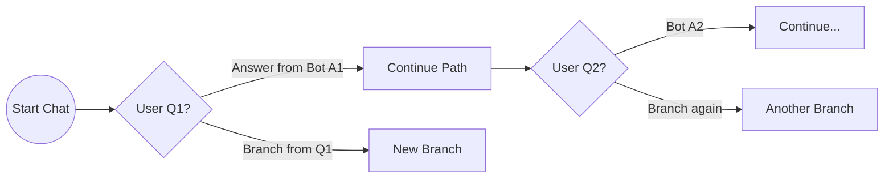
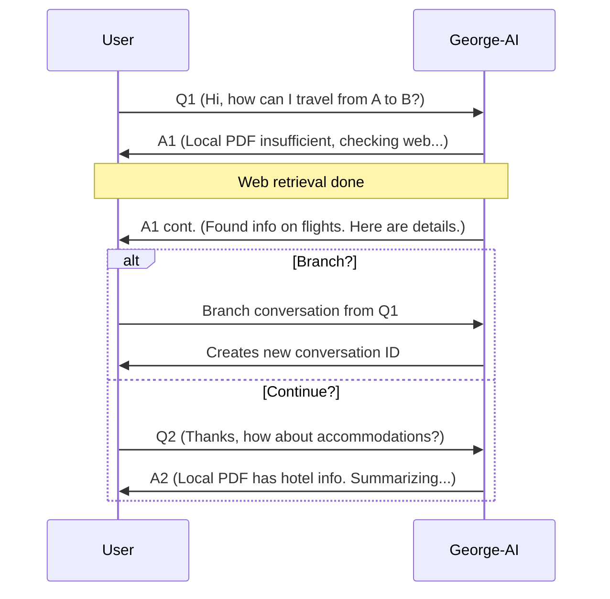
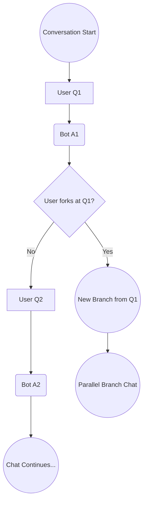

Below is an **example** of how you might represent **branching conversation flows** using **[Mermaid](https://mermaid-js.github.io/mermaid)** diagrams. Mermaid supports various diagram types (flowcharts, sequence diagrams, state diagrams, etc.). Here, we’ll use a **flowchart** to visualize a simple chat branching structure.

---

## **1. Basic Flow Chart with Branches**

### **Explanation**

- **`flowchart LR`**: Mermaid draws a flowchart **Left to Right**.
- **`A((Start Chat))`**: A “rounded circle” node for the chat start.
- **`B{User Q1?}`**: A diamond-shaped decision node (in typical flowchart style).
- The edges **(`B -->|...| C`)** show different outcomes: one path continues the normal conversation, another “branch” triggers a new path.

---

## **2. More Detailed “Conversation Sequence”**

If you want to show each user/bot message in a timeline, you could do a **sequence diagram** instead of a flowchart.

**Sequence Diagram Example**:

### **Explanation**

- **`sequenceDiagram`** sets the type.
- **`participant U as User`** and **`participant G as George-AI`** define the conversation actors.
- The **`alt Branch?`** / **`else Continue?`** block visually shows a branching logic.

---

## **3. Detailed Branching with Re-Edits (Flowchart)**

- Here we see **`A --> B --> G --> C`** for the first Q&A.
- A **diamond** node `C` asks if the user forks or not.
- If yes, it goes to `D`, creating a new branch path. If no, it continues linearly.

---

## **Conclusion & Usage**

- **Mermaid** is a convenient text-based syntax for creating flowcharts, sequence diagrams, and more to visualize your conversation branching or chat flows.
- You can place these code blocks in your **Markdown** documents (e.g., GitHub, docs site) or in a tool supporting Mermaid to render them.

Use whichever diagram style best fits your **chat** branching concept:

- **Flowcharts** for high-level “if/then” logic.
- **Sequence** diagrams for step-by-step user/bot messages.

With these examples, you can illustrate how messages flow and how conversation branching occurs visually.
