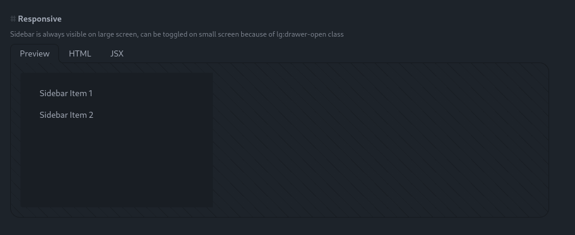

## **Feature Tasks**

### 1) **User can list conversations**

- **Approach**: Use a [DaisyUI drawer](https://daisyui.com/components/drawer/) on the left side to show all user conversations.
- **UI Example**:

  ```
  +-----------------------------------------------------+
  |  (Drawer Button)  (Conversation Title)    (Settings)|
  +-----------------------------------------------------+
   |  SIDEBAR (DRAWER)           |   MAIN CONTENT       |
   |  * Conversation #1          |   Chat messages...   |
   |  * Conversation #2          |   Chat messages...   |
   |  * ...                      |   Chat messages...   |
   +-----------------------------------------------------+
  ```

  

### 2) **User can reload conversation history**

- **Goal**: Once a conversation is selected from the drawer, **fetch** its messages (Q&A) and display them in chronological order.

### 3) **Suggest a Prisma Schema**

A simple data model to store **conversations** and **messages**:

```prisma
model Conversation {
  id           String   @id @default(uuid())
  userId       String
  title        String?
  createdAt    DateTime @default(now())
  updatedAt    DateTime @updatedAt
  messages     Message[]
}

model Message {
  id              String       @id @default(uuid())
  conversationId  String
  conversation    Conversation @relation(fields: [conversationId], references: [id])
  parentMessageId String?
  sender          String       // 'user' or 'bot'
  content         String
  createdAt       DateTime     @default(now())
  retrievalFlow   String?      // e.g. 'Sequential'
}
```

### 4) **Suggest a GraphQL**

A **GraphQL** example for storing conversations:

```graphql
type Conversation {
  id: ID!
  userId: String!
  title: String
  messages: [Message!]!
  createdAt: DateTime
  updatedAt: DateTime
}

type Message {
  id: ID!
  conversationId: ID!
  parentMessageId: ID
  sender: String
  content: String
  retrievalFlow: String
  createdAt: DateTime
}

type Query {
  conversations(userId: String!): [Conversation!]!
  conversation(id: ID!): Conversation
}

type Mutation {
  createConversation(userId: String!, title: String): Conversation!
  addMessage(
    conversationId: ID!
    parentMessageId: ID
    sender: String!
    content: String!
    retrievalFlow: String
  ): Message!
}
```

### 5) **Conversation Branching**

- **Inspiration**: Like ChatGPT’s “go back & edit” or “fork” a conversation.
- **Implementation**:
  1. Each message can have a `parentMessageId`.
  2. When user clicks “Branch from here,” the system creates a **new** message chain from that point.

Example UI Concept:

```
[User Q1]  -> [Bot A1]
   |
   --> Branch --> [User Q1 alt?] -> [Bot A1 alt?] ...
```

### 6) **Suggest UI for Branching**

- **Context Menu** on each old message: “Branch from Here.”
- **Visualization**: Possibly a small “branch graph” or conversation tree for advanced usage.

### 7) **RetrievalFlow Feedback**

- **Idea**: Add a “debug console” or “detailed steps” panel so the user can see each retrieval stage (Local vs. Web) and provide feedback:
  - “Yes, local had the data, but not recognized.”
  - “Web was accurate.”

This helps refine how the assistant picks retrieval flows in future interactions.

---

**That’s it!** These enhancements will provide a more robust, user-friendly experience: listing, reloading, and branching conversations; plus feedback on the **RetrievalFlow** to continuously improve results.
