# Architecture

George AI is built as a monorepo using pnpm workspaces, with a modern stack focused on type safety and developer experience.

## High-Level Architecture

The core concept of George AI: Collect data from any source, convert everything to Markdown, then chunk and embed for semantic search.

```mermaid
flowchart TD
    Sources["📊 Data Sources<br/>Crawlers, External Ingestion, Manual Upload"]

    UI["👤 Business Users<br/>(chat-web UI)"]

    subgraph George["🎳 George AI - Markdown Processing"]
        direction TB
        LibraryConfig["📚 Library Configuration<br/>Embedding Model, OCR Settings"]
        Processing["📝 Processing Pipeline<br/>Markdown Conversion → Chunking → Embedding"]
    end

    subgraph Enrichment["✨ George AI - Enrichment"]
        direction TB
        ListConfig["📋 Lists Configuration<br/>Define Fields & Extraction Rules"]
        EnrichWorker["✨ Background Worker<br/>LLM Structured Data Extraction"]
    end

    Storage["💾 Storage<br/>PostgreSQL (Metadata) + Typesense (Vectors) + Lists"]

    Consumption["🎯 Consumption<br/>Business Users, Workflows, AI Agents, Apps"]

    Sources --> George
    UI --> LibraryConfig
    UI --> ListConfig
    LibraryConfig -.configures.-> Processing
    Processing --> Storage
    Storage --> EnrichWorker
    ListConfig -.configures.-> EnrichWorker
    EnrichWorker --> Storage
    Storage --> Consumption

    style Sources fill:#e3f2fd,stroke:#1976d2,stroke-width:2px,color:#000
    style UI fill:#c8e6c9,stroke:#2e7d32,stroke-width:3px,color:#000
    style George fill:#fff3e0,stroke:#f57c00,stroke-width:3px,color:#000
    style Enrichment fill:#e1f5fe,stroke:#0277bd,stroke-width:3px,color:#000
    style Storage fill:#f3e5f5,stroke:#7b1fa2,stroke-width:3px,color:#000
    style Consumption fill:#e8f5e9,stroke:#388e3c,stroke-width:2px,color:#000

    style LibraryConfig fill:#ffe0b2,stroke:#e65100,stroke-width:2px,color:#000
    style Processing fill:#ffe0b2,stroke:#e65100,stroke-width:2px,color:#000
    style ListConfig fill:#b3e5fc,stroke:#01579b,stroke-width:2px,color:#000
    style EnrichWorker fill:#b3e5fc,stroke:#01579b,stroke-width:2px,color:#000
```

**Key Insights**:
- **Markdown-First**: All content is converted to Markdown for consistent, high-quality vector generation
- **Dual Output**: Documents become both searchable vectors AND structured data (Lists) via enrichments
- **Single Source of Truth**: One unified platform for unstructured (vectors) and structured (Lists) data

## Applications

### chat-web (Frontend)
- **Framework**: React 19 with TanStack Router and TanStack Server
- **Build System**: Vite
- **GraphQL Client**: graphql-request with code-generated types
- **Authentication**: Keycloak integration
- **Styling**: Tailwind CSS with twMerge for conditional classNames
- **Routing**: File-based routing at `src/routes/`
- **Port**: 3001 (development)

### georgeai-server (Backend API)
- **Runtime**: Node.js with TypeScript
- **Framework**: Express server with GraphQL Yoga
- **Build System**: TypeScript compiler (tsc)
- **Schema**: Pothos for code-first GraphQL schema generation
- **Authentication**: JWT authentication with Keycloak integration
- **Workers**: Content processing and enrichment queue workers
- **Port**: 3003 (development)

### marketing-web (Public Website)
- **Framework**: Astro with server-side rendering
- **Styling**: Tailwind CSS with DaisyUI components
- **Features**: Landing page, use cases, documentation, contact form
- **Docker**: Node.js adapter for dynamic functionality
- **Port**: 4321 (development)

### crawler-server (Web Crawler)
- **Framework**: Python FastAPI
- **Crawler**: Crawl4AI with Playwright for JavaScript rendering
- **Features**: Web page crawling, content extraction, cleaning
- **Port**: 11235 (production), 8000 (development)
- **⚠️ Status**: Subject to change - may be replaced with TypeScript implementation

## Core Packages

### pothos-graphql
- GraphQL schema definitions using Pothos
- Prisma database layer with migrations
- Background workers for content processing and enrichment queues

### langchain-chat
- Document processing and embeddings generation
- Conversation chains and retrieval
- Typesense vector store integration

### ai-service-client
- Ollama resource manager with intelligent load balancing
- Multi-instance support (up to 10 instances) with GPU-aware routing
- **Key Differentiator**: Enables horizontal scaling of AI services

### file-converter
- Markdown conversion from PDFs, DOCX, Excel, HTML
- OCR processing with vision models
- Configurable via Library UI

## External Services

### PostgreSQL
- Metadata storage: users, libraries, files, conversations, enrichments, lists
- Managed via Prisma ORM with TypedSQL for complex queries

### Typesense
- Vector search engine storing document embeddings and markdown chunks
- Provides fast semantic and hybrid search (keyword + vector)

### Keycloak
- Authentication and authorization (OAuth2/OIDC)
- Multi-tenant user management with social login support

### Ollama (Optional)
- Local LLM inference server for embeddings and text generation
- Supports open-source models (Llama, Qwen, Mistral, etc.)
- Multi-instance support via ai-service-client load balancer

## Key Design Principles

### 1. Centralized Vector Store
George AI acts as a single source of truth for vector embeddings across all use cases. This eliminates the need for separate vector stores per application or workflow.

### 2. Dual-Purpose Platform
- **Business Users**: First-class UI for searching, organizing, and enriching data
- **AI Applications**: Full GraphQL API for n8n workflows, AI agents, and custom integrations

### 3. Data Quality Focus
- Vector quality testing and analysis
- Enrichment validation and statistics
- Real-time monitoring of data processing quality

### 4. Self-Hosted First
- All data stays on user infrastructure
- Local AI processing with Ollama
- No dependency on external AI services
- Multi-tenant support for service providers

## Scalability

George AI is designed to scale horizontally:

- **Ollama Load Balancing**: ai-service-client supports up to 10 Ollama instances with GPU-aware routing and automatic failover - enabling cost-effective AI scaling without cloud dependencies
- **Backend**: Stateless servers can run multiple instances behind load balancer
- **Database**: PostgreSQL replication support for read-heavy workloads
- **Search**: Typesense clustering for high availability
