# Architecture

George AI is built as a monorepo using pnpm workspaces, with a modern stack focused on type safety and developer experience.

## Table of Contents

- [High-Level Architecture](#high-level-architecture)
- [Applications](#applications)
- [Core Packages](#core-packages)
- [External Services](#external-services)
- [Document Processing Flow](#document-processing-flow)
- [GraphQL Schema Generation](#graphql-schema-generation)
- [Authentication Flow](#authentication-flow)
- [Development Workflows](#development-workflows)
- [Key Design Principles](#key-design-principles)
- [Scalability](#scalability)

---

## High-Level Architecture

The core concept of George AI: Collect data from any source, convert everything to Markdown, then chunk and embed for semantic search.

```mermaid
flowchart TD
    Sources["📊 Data Sources<br/>Crawlers, External Ingestion, Manual Upload"]

    UI["👤 Business Users<br/>(chat-web UI)"]

    subgraph George["🎳 George AI - Markdown Processing"]
        direction TB
        LibraryConfig["📚 Library Configuration<br/>Embedding Model, OCR Settings"]
        Processing["📝 Processing Pipeline<br/>Markdown Conversion → Chunking → Embedding"]
    end

    subgraph Enrichment["✨ George AI - Enrichment"]
        direction TB
        ListConfig["📋 Lists Configuration<br/>Define Fields & Extraction Rules"]
        EnrichWorker["✨ Background Worker<br/>LLM Structured Data Extraction"]
    end

    Storage["💾 Storage<br/>PostgreSQL (Metadata) + Typesense (Vectors) + Lists"]

    Consumption["🎯 Consumption<br/>Business Users, Workflows, AI Agents, Apps"]

    Sources --> George
    UI --> LibraryConfig
    UI --> ListConfig
    LibraryConfig -.configures.-> Processing
    Processing --> Storage
    Storage --> EnrichWorker
    ListConfig -.configures.-> EnrichWorker
    EnrichWorker --> Storage
    Storage --> Consumption

    style Sources fill:#e3f2fd,stroke:#1976d2,stroke-width:2px,color:#000
    style UI fill:#c8e6c9,stroke:#2e7d32,stroke-width:3px,color:#000
    style George fill:#fff3e0,stroke:#f57c00,stroke-width:3px,color:#000
    style Enrichment fill:#e1f5fe,stroke:#0277bd,stroke-width:3px,color:#000
    style Storage fill:#f3e5f5,stroke:#7b1fa2,stroke-width:3px,color:#000
    style Consumption fill:#e8f5e9,stroke:#388e3c,stroke-width:2px,color:#000

    style LibraryConfig fill:#ffe0b2,stroke:#e65100,stroke-width:2px,color:#000
    style Processing fill:#ffe0b2,stroke:#e65100,stroke-width:2px,color:#000
    style ListConfig fill:#b3e5fc,stroke:#01579b,stroke-width:2px,color:#000
    style EnrichWorker fill:#b3e5fc,stroke:#01579b,stroke-width:2px,color:#000
```



**Key Insights**:

- **Markdown-First**: All content is converted to Markdown for consistent, high-quality vector generation
- **Dual Output**: Documents become both searchable vectors AND structured data (Lists) via enrichments
- **Single Source of Truth**: One unified platform for unstructured (vectors) and structured (Lists) data

---

## Applications

### chat-web (Frontend)

- **Framework**: React 19 with TanStack Router and TanStack Server
- **Build System**: Vite
- **GraphQL Client**: graphql-request with code-generated types
- **Authentication**: Keycloak integration
- **Styling**: Tailwind CSS with twMerge for conditional classNames
- **Routing**: File-based routing at `app/routes/`
- **Port**: 3001 (development)

### georgeai-server (Backend API)

- **Runtime**: Node.js with TypeScript
- **Framework**: Express server with GraphQL Yoga
- **Build System**: TypeScript compiler (tsc)
- **Schema**: Pothos for code-first GraphQL schema generation
- **Authentication**: JWT authentication with Keycloak integration
- **Workers**: Content processing and enrichment queue workers
- **Port**: 3003 (development)

### marketing-web (Public Website)

- **Framework**: Astro with Tailwind CSS
- **Build**: Static site generation (SSG) with Node adapter for dynamic features
- **Purpose**: Marketing pages, documentation, contact forms
- **Deployment**: Serves as public-facing website at george-ai.net

### crawler-server (Web Crawler)

- **Runtime**: Python with FastAPI
- **Purpose**: Web page crawling and content extraction
- **Status**: Will be replaced with integrated solution

---

## Core Packages

### pothos-graphql

- GraphQL schema definitions using Pothos (code-first)
- Resolvers for all GraphQL operations
- Prisma database layer with migrations
- Background workers for content processing and enrichment queues

### langchain-chat

- Document processing and embeddings generation
- Conversation chains and retrieval
- Typesense vector store integration
- Integration with ai-service-client for LLM access

### ai-service-client

- Ollama resource manager with intelligent load balancing
- Multi-instance support (up to 10 instances) with GPU-aware routing
- Model availability checking and automatic failover
- **Key Differentiator**: Enables horizontal scaling of AI services

### file-converter

- Markdown conversion from PDFs, DOCX, Excel, HTML
- OCR processing with vision models
- Unified markdown output for all document types

### file-management

- File upload and storage management
- Metadata extraction
- File access control

### web-utils

- Shared utilities for validation, formatting
- Common TypeScript types
- Form validation helpers

---

## External Services

### PostgreSQL

- **Purpose**: Primary database for metadata, users, libraries, files, lists
- **Version**: 16
- **Port**: 5432 (main), 5433 (Keycloak)
- **Managed via**: Prisma ORM with migrations

### Typesense

- **Purpose**: Vector search engine for semantic search
- **Version**: 27.1
- **Port**: 8108
- **Features**: Stores embeddings, enables hybrid search (text + vectors)

### Keycloak

- **Purpose**: Authentication and user management
- **Version**: 26.4
- **Port**: 8180
- **Features**: OAuth/OIDC, SSO, identity providers (Google, GitHub)

### Ollama (Optional)

- **Purpose**: Local LLM inference
- **Port**: 11434
- **Features**: Supports multiple models, GPU acceleration, multi-instance support

### Docker Networking

All services communicate via Docker network (`george-ai-network`):

- Services reference each other by container name
- Frontend → Backend: `http://backend:3003`
- Backend → Database: `postgresql://postgres:5432`
- Backend → Typesense: `http://typesense:8108`

---

## Document Processing Flow

### Markdown Processing Pipeline

1. **User uploads documents** (PDF, Excel, Word, HTML) via GraphQL mutation or crawlers
2. **Backend stores files** and creates database records in PostgreSQL
3. **file-converter converts to Markdown** - All document types → unified Markdown format
4. **langchain-chat chunks Markdown** into semantic chunks
5. **ai-service-client generates embeddings** via Ollama load balancer
6. **Embeddings + Markdown stored in Typesense** for semantic search
7. **Metadata stored in PostgreSQL** for filtering and organization

### Enrichment Processing

1. **Business users configure enrichments** via Lists UI (no-code)
2. **Enrichment worker processes documents** in background using LLM
3. **Structured data extracted** and stored in PostgreSQL Lists
4. **Validation and statistics** tracked for quality monitoring

---

## GraphQL Schema Generation

- Schema defined in `packages/pothos-graphql/src/graphql/`
- Use **Pothos builder pattern** for type-safe schema definition
- Run codegen after schema changes:
  ```bash
  cd /workspaces/george-ai/apps/chat-web && pnpm codegen
  ```

**Important:** Always define a GraphQL Fragment for components and rely on codegen instead of defining your own interfaces for entities. See [Code Patterns](./patterns.md) for details.

---

## Authentication Flow

1. **Keycloak** handles user authentication (OAuth/OIDC)
2. **JWT tokens** issued by Keycloak and sent with requests
3. **Backend validates JWT** on every GraphQL request
4. **User context** available in GraphQL resolvers via `ctx.user`
5. **Frontend** uses Keycloak React adapter for auth state

**Supported Identity Providers:**

- Google OAuth
- GitHub OAuth
- LinkedIn OAuth
- Username/Password

---

## Development Workflows

### 1. Feature Development

1. Create/modify GraphQL schema in `packages/pothos-graphql/src/graphql/`
2. Run `cd /workspaces/george-ai/apps/chat-web && pnpm codegen` to generate types
3. Implement resolvers and business logic in backend
4. Update frontend components and queries
5. Test with `pnpm typecheck` and `pnpm lint`

### 2. Database Changes

1. Modify Prisma schema in `packages/pothos-graphql/prisma/schema.prisma`
2. Create migration:
   ```bash
   cd packages/pothos-graphql
   pnpm prisma migrate dev --name your_migration_name
   ```
3. **CRITICAL**: Regenerate typedSql types:
   ```bash
   pnpm prisma generate --sql
   ```
4. Update GraphQL schema if needed
5. Run codegen to update frontend types

### 3. Adding AI Features

1. Implement in `packages/langchain-chat`
2. Use existing document/embedding infrastructure
3. Test with different AI providers (Ollama, OpenAI)
4. Update ai-service-client if needed for load balancing

### 4. Frontend Routes

1. Add new route file in `apps/chat-web/app/routes/`
2. Use TanStack Router file-based routing conventions
3. Leverage existing authentication and GraphQL hooks
4. Follow patterns in existing routes for consistency

### 5. Adding Crawlers

1. Implement crawler in `packages/crawlers/`
2. Use existing crawler interfaces
3. Test with different data sources
4. Integrate with file-converter for markdown conversion

---

## Key Design Principles

### 1. Centralized Vector Store

George AI maintains a centralized vector store in Typesense, ensuring:

- **Single source of truth** for all embedded documents
- **Consistent search quality** across all libraries
- **Efficient updates** when embeddings models change

### 2. Dual-Purpose Platform

George AI serves two primary use cases:

- **Business users** directly search and organize data through the UI
- **AI applications and workflows** query the same data via GraphQL API
- This dual approach ensures data quality is maintained by business experts

### 3. Data Quality Focus

Rather than competing on inference speed or model capabilities, George AI focuses on:

- **Input data quality**: Markdown normalization, semantic chunking
- **Metadata enrichment**: Business users add context and structure
- **Quality validation**: Statistics and validation for enrichments

### 4. Self-Hosted First

- All core functionality works without external APIs
- Optional integrations with OpenAI, Tavily, etc.
- Data remains on customer infrastructure
- Business Source License (BSL 1.1) until 2029, then Apache 2.0

---

## Scalability

### Horizontal Scaling

- **Frontend**: Multiple instances behind load balancer
- **Backend**: Stateless design allows multiple instances
- **Ollama**: Multi-instance support with GPU-aware load balancing (ai-service-client)
- **Workers**: Separate processes for content processing and enrichment queues

### Vertical Scaling

- **PostgreSQL**: Increase resources, enable read replicas
- **Typesense**: Cluster mode for high availability
- **Docker resources**: Adjust memory/CPU limits per service

### Performance Optimization

- **Caching**: Redis cache layer (optional)
- **CDN**: Static assets served via CDN
- **Database indexing**: Optimized queries with proper indexes
- **Background processing**: Queue-based workers for heavy operations

---

## Environment Configuration

### Required `.env` Files

- Root directory (for running both apps with `pnpm dev`)
- `apps/georgeai-server/.env` (if running separately)
- `apps/chat-web/.env` (if running separately)
- `packages/pothos-graphql/.env` (for Prisma commands)

### Key Environment Variables

- `DATABASE_URL`: PostgreSQL connection string
- `KEYCLOAK_URL`, `KEYCLOAK_REALM`, `KEYCLOAK_CLIENT_ID`: Authentication
- `TYPESENSE_API_KEY`, `TYPESENSE_HOST`: Vector search
- `BACKEND_URL`, `BACKEND_PUBLIC_URL`: GraphQL endpoint
- `OLLAMA_BASE_URL`: AI inference (optional)

See `.env.example` files for complete reference.

---

## Translation System

Translation files are located in:

- **English**: `apps/chat-web/app/i18n/en.ts`
- **German**: `apps/chat-web/app/i18n/de.ts`

When adding new translation keys (especially for form validation), ensure both files are updated.

---

## Additional Resources

- **Code Patterns**: [patterns.md](./patterns.md)
- **Developer Setup**: [developer-setup.md](./developer-setup.md)
- **Self-Hosting Guide**: [self-hosting.md](./self-hosting.md)
- **Contributing**: [../.github/CONTRIBUTING.md](../.github/CONTRIBUTING.md)
