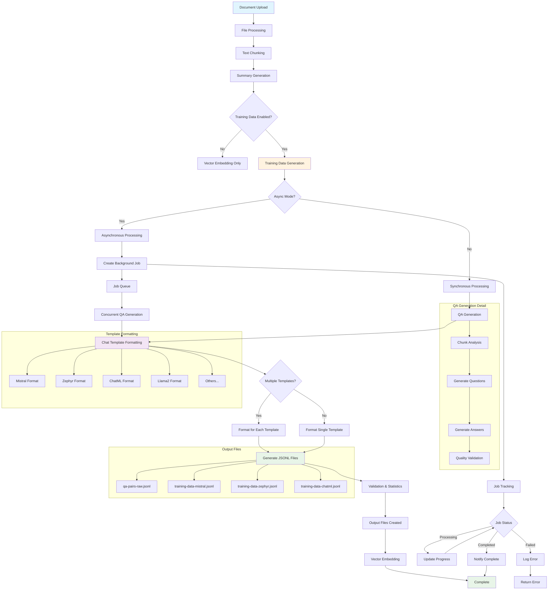
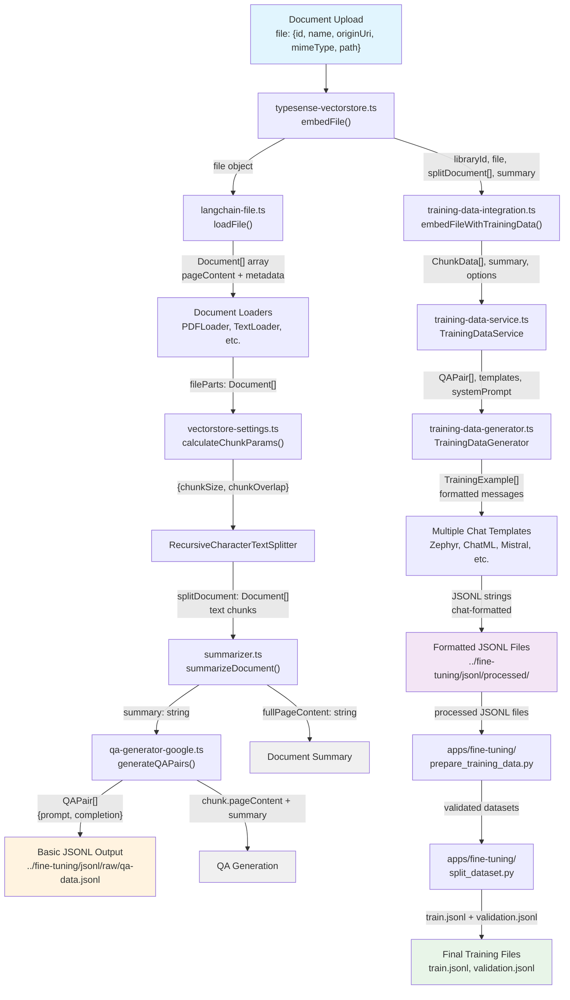
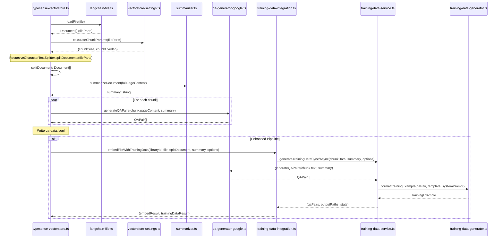
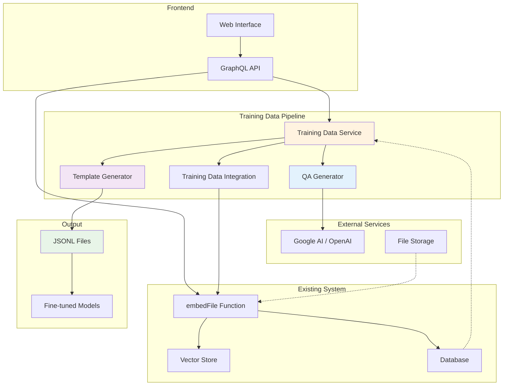
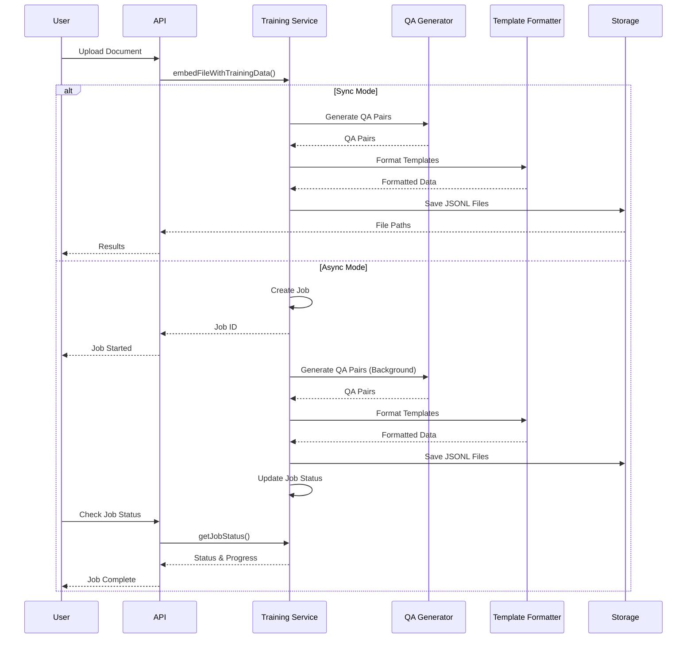

# Training Data Pipeline for Fine-tuning

A comprehensive TypeScript pipeline for generating high-quality training datasets from document chunks for supervised fine-tuning of language models.

## Overview

This pipeline integrates seamlessly with your existing document processing system to generate properly formatted training data for different language models. It supports both synchronous and asynchronous processing with job tracking.

### Key Features

- **Chat Template Support**: Formats for Mistral, Zephyr, Llama2, Qwen, Gemma, ChatML, and Alpaca
- **Async Processing**: Non-blocking training data generation with job tracking
- **Quality Control**: Validation, statistics, and preview capabilities
- **Modular Architecture**: Easy integration with existing systems
- **Scalable**: Batch processing with concurrency control

## Pipeline Flow

The training data pipeline follows this comprehensive flow:



### Pipeline Components

1. **Document Processing**: Files are loaded and split into manageable chunks
2. **QA Generation**: Each chunk is analyzed to create relevant question-answer pairs
3. **Template Formatting**: QA pairs are formatted for specific model chat templates
4. **Output Generation**: Multiple JSONL files are created for different models
5. **Job Management**: Async processing with progress tracking and error handling

## Detailed Data Flow: From Document to Training Data

This section provides a comprehensive view of how data flows through the system from initial document upload to final training files.

### Complete File-by-File Data Flow



### Detailed Processing Steps

#### Data Flow Specifications

**Input File Object:**

```typescript
{
  id: string,           // Unique file identifier
  name: string,         // Original filename
  originUri: string,    // Source URL or path
  mimeType: string,     // MIME type (application/pdf, text/plain, etc.)
  path: string          // Local file path
}
```

**Document Array (fileParts):**

```typescript
Document[] = [
  {
    pageContent: string,     // Extracted text content
    metadata: {
      source: string,        // File path
      loc?: {
        pageNumber?: number  // Page number for PDFs
      }
    }
  }
]
```

**Chunk Parameters:**

```typescript
{
  chunkSize: number,      // Calculated chunk size (500-1000 chars)
  chunkOverlap: number    // Overlap between chunks (10% of chunkSize)
}
```

**Split Documents (chunks):**

```typescript
Document[] = [
  {
    pageContent: string,  // Text chunk content
    metadata: {
      docId: string,      // File ID
      docName: string,    // File name
      chunkIndex: number  // Chunk position
    }
  }
]
```

**QA Pairs:**

```typescript
QAPair[] = [
  {
    prompt: string,              // Generated question
    completion: string,          // Generated answer
    evalCriteria?: string[],     // Quality evaluation criteria
    category?: string,           // Content category
    difficulty?: string,         // Question difficulty
    chunkId?: string,           // Source chunk identifier
    sourceText?: string,        // Original chunk text
    metadata?: Record<string, any>
  }
]
```

**Training Examples (formatted):**

```typescript
TrainingExample[] = [
  {
    messages: [
      { role: 'system', content: string },    // System prompt
      { role: 'user', content: string },      // Question
      { role: 'assistant', content: string }  // Answer
    ],
    chunkId?: string,
    sourceText?: string,
    metadata?: Record<string, any>
  }
]
```

**Final JSONL Format:**

```jsonl
{"text":"<s>[INST] What is the EU AI Act? [/INST]The EU AI Act is...</s>","template":"mistral"}
{"text":"<|user|>\nWhat are high-risk AI systems?</s>\n<|assistant|>\nHigh-risk AI systems...</s>","template":"zephyr"}
```

#### 1. **Entry Point**: `typesense-vectorstore.ts`

- **Function**: `embedFile()`
- **Purpose**: Main orchestrator for document processing and embedding
- **Key Operations**:
  - Loads file using `loadFile()`
  - Calculates chunk parameters
  - Splits document into chunks
  - Generates document summary
  - Creates QA pairs from chunks
  - Writes basic JSONL output

#### 2. **File Loading**: `langchain-file.ts`

- **Function**: `loadFile()`
- **Purpose**: Loads documents based on MIME type
- **File Types Supported**: PDF, DOCX, CSV, Excel, Text, Markdown
- **Output**: Array of Document objects with pageContent

#### 3. **Chunk Configuration**: `vectorstore-settings.ts`

- **Function**: `calculateChunkParams()`
- **Purpose**: Determines optimal chunk size and overlap
- **Logic**: Calculates based on average document length (500-1000 chars, 10% overlap)

#### 4. **Document Summarization**: `summarizer.ts`

- **Function**: `summarizeDocument()`
- **Purpose**: Creates document summary for context in QA generation
- **Model**: GPT-4o-mini via OpenAI

#### 5. **QA Generation**: `qa-generator-google.ts`

- **Function**: `generateQAPairs()`
- **Purpose**: Generates question-answer pairs from document chunks
- **Model**: Llama3.2:latest (configurable)
- **Output**: Array of QAPair objects with prompt/completion

#### 6. **Basic Output**: First JSONL Creation

- **Location**: `../fine-tuning/jsonl/raw/qa-data.jsonl`
- **Format**: Simple JSONL with `{"prompt": "...", "completion": "..."}`
- **Purpose**: Raw QA pairs without chat formatting

#### 7. **Enhanced Pipeline**: `training-data-integration.ts`

- **Function**: `embedFileWithTrainingData()`
- **Purpose**: Wrapper for enhanced training data generation
- **Features**: Async processing, multiple templates, custom system prompts

#### 8. **Service Layer**: `training-data-service.ts`

- **Class**: `TrainingDataService`
- **Purpose**: Manages training data jobs and processing
- **Features**:
  - Async job management
  - Batch processing
  - Error handling and retry logic
  - Progress tracking

#### 9. **Template Generation**: `training-data-generator.ts`

- **Class**: `TrainingDataGenerator`
- **Purpose**: Formats QA pairs into specific chat templates
- **Templates Supported**:
  - **Zephyr**: `<|system|>`, `<|user|>`, `<|assistant|>`
  - **ChatML**: `<|im_start|>`, `<|im_end|>`
  - **Mistral**: `[INST]`, `[/INST]`
  - **Llama2**: `<<SYS>>`, `<</SYS>>`
  - **Gemma**: `<start_of_turn>`, `<end_of_turn>`
  - **Qwen**: `<|im_start|>` (Qwen variant)
  - **Alpaca**: Instruction-following format

#### 10. **Processed Output**: Advanced JSONL Files

- **Location**: `../fine-tuning/jsonl/processed/`
- **Files Generated**:
  - `{template_name}_training_data.jsonl`
  - `qa_pairs_raw.jsonl`
  - `training_stats.json`
- **Format**: Chat-formatted messages with proper tokens

#### 11. **Python Processing**: `apps/fine-tuning/prepare_training_data.py`

- **Purpose**: Further processes JSONL files for specific model requirements
- **Operations**: Validation, filtering, format conversion

#### 12. **Dataset Splitting**: `apps/fine-tuning/split_dataset.py`

- **Purpose**: Splits data into training and validation sets
- **Output**:
  - `train.jsonl` (80% of data)
  - `validation.jsonl` (20% of data)

#### 13. **Final Training Files**

- **Location**: `apps/fine-tuning/finetune-output/`
- **Files**: Ready-to-use training datasets for various model architectures
- **Formats**: Compatible with fine-tuning frameworks (Ollama, HuggingFace, etc.)

### Key Data Transformations

1. **Raw Document** → **Document Objects** (langchain-file.ts)
2. **Document Objects** → **Text Chunks** (RecursiveCharacterTextSplitter)
3. **Text Chunks** → **QA Pairs** (qa-generator-google.ts)
4. **QA Pairs** → **Basic JSONL** (typesense-vectorstore.ts)
5. **QA Pairs** → **Chat-Formatted JSONL** (training-data-generator.ts)
6. **Chat JSONL** → **Training/Validation Sets** (Python scripts)

### Function Call Chain



### Data Flow Summary

This pipeline provides a complete flow from document upload to production-ready fine-tuning datasets:

- **Input**: Any supported document format (PDF, DOCX, TXT, etc.)
- **Processing**: Intelligent chunking, QA generation, and chat formatting
- **Output**: Multiple JSONL files ready for fine-tuning different model architectures
- **Integration**: Seamless integration with existing vector embedding workflow

## File Structure

```
src/
├── qa-generator-google.ts          # QA pair generation from chunks
├── training-data-generator.ts      # Chat template formatting
├── training-data-service.ts        # Main service with sync/async processing
├── training-data-integration.ts    # Integration with existing embedFile
├── training-data-examples.ts       # Usage examples
└── README.md                      # This file
```

## Architecture

### System Integration



### Data Flow



### Current Flow

```
Document Upload → Text Chunking → QA Generation → Training Data → Fine-tuning
```

### Enhanced Flow

```
Document Upload → Text Chunking → [QA Generation + Vector Embedding] → Training Data → Fine-tuning
                                          ↓
                                    Job Tracking (Async)
```

## Usage

### 1. Basic Integration

```typescript
import { embedFileWithTrainingData } from './training-data-integration'

// Enhanced embedFile with training data generation
const result = await embedFileWithTrainingData(
  libraryId,
  file,
  splitDocument,
  summary,
  {
    enableTrainingData: true,
    enableAsync: false,
    templates: ['mistral', 'zephyr'],
    systemPrompt: "You are an AI assistant specialized in EU regulations.",
    outputDir: './training-data'
  }
)

console.log(\`Generated \${result.trainingDataResult?.qaPairs.length} QA pairs\`)
```

### 2. Asynchronous Processing

```typescript
// Start async training data generation
const result = await embedFileWithTrainingData(
  libraryId,
  file,
  splitDocument,
  summary,
  {
    enableTrainingData: true,
    enableAsync: true,
    templates: ['qwen', 'llama2'],
    maxConcurrency: 3,
    batchSize: 5
  }
)

// Monitor job progress
const jobId = result.trainingDataResult?.jobId
const job = trainingDataService.getJobStatus(jobId)
console.log(\`Job status: \${job?.status}\`)
```

### 3. Direct Service Usage

```typescript
import { trainingDataService } from './training-data-service'

// Generate training data directly
const chunkData = [
  {
    id: 'chunk-1',
    text: 'Your document text here...',
    docId: 'doc-123',
    docName: 'document.pdf',
    libraryId: 'lib-456',
    chunkIndex: 0,
  },
]

const result = await trainingDataService.generateTrainingDataSync(chunkData, 'Document summary', {
  templates: ['mistral', 'zephyr'],
  systemPrompt: 'Custom system prompt',
})
```

## Chat Template Examples

### Mistral Format

```
<s>[INST] What is the EU AI Act? [/INST]The EU AI Act is comprehensive legislation...</s>
```

### Zephyr Format

```
<|system|>
You are a helpful assistant.</s>
<|user|>
What is the EU AI Act?</s>
<|assistant|>
The EU AI Act is comprehensive legislation...</s>
```

### ChatML Format

```
<|im_start|>system
You are a helpful assistant.<|im_end|>
<|im_start|>user
What is the EU AI Act?<|im_end|>
<|im_start|>assistant
The EU AI Act is comprehensive legislation...<|im_end|>
```

## Integration with Existing System

### 1. Modify embedFile Function

```typescript
// In typesense-vectorstore.ts
export const embedFile = async (
  libraryId: string,
  file: FileData,
  options: {
    enableTrainingData?: boolean
    enableAsync?: boolean
    templates?: string[]
    systemPrompt?: string
  } = {},
) => {
  // ... existing code ...

  const result = await embedFileWithTrainingData(libraryId, file, splitDocument, summary, {
    enableTrainingData: options.enableTrainingData || false,
    enableAsync: options.enableAsync || false,
    templates: options.templates || ['chatml'],
    systemPrompt: options.systemPrompt,
  })

  // Continue with vector embedding
  await Typesense.fromDocuments(splitDocument, embeddings, typesenseVectorStoreConfig)

  return {
    ...result.embedResult,
    trainingData: result.trainingDataResult,
  }
}
```

### 2. Add GraphQL API

```typescript
// Add to GraphQL schema
export const startTrainingDataGeneration = createServerFn({ method: 'POST' })
  .validator(trainingDataRequestSchema)
  .handler(async (ctx) => {
    const { libraryId, fileId, templates, systemPrompt, enableAsync } = ctx.data

    // Get file chunks from database
    const chunks = await getFileChunksFromDatabase(libraryId, fileId)
    const summary = await getFileSummary(libraryId, fileId)

    if (enableAsync) {
      const jobId = await trainingDataService.generateTrainingDataAsync(chunks, summary, {
        templates,
        systemPrompt,
        enableAsync: true,
      })
      return { jobId, status: 'started' }
    } else {
      const result = await trainingDataService.generateTrainingDataSync(chunks, summary, { templates, systemPrompt })
      return {
        qaPairs: result.qaPairs.length,
        outputPaths: result.outputPaths,
        stats: result.stats,
      }
    }
  })
```

### 3. Add UI Components

```typescript
// Training data generation button in the UI
const handleGenerateTrainingData = async () => {
  const result = await startTrainingDataGeneration({
    libraryId: 'lib-123',
    fileId: 'file-456',
    templates: ['mistral', 'zephyr'],
    systemPrompt: 'Custom system prompt',
    enableAsync: true,
  })

  if (result.jobId) {
    // Start monitoring job
    monitorTrainingDataJob(result.jobId)
  }
}
```

## Configuration

### Environment Variables

```env
# Training data output directory
TRAINING_DATA_OUTPUT_DIR=./training-data

# Default system prompt
DEFAULT_SYSTEM_PROMPT="You are a helpful AI assistant that provides accurate and informative answers."

# Async processing settings
MAX_CONCURRENCY=3
BATCH_SIZE=5
```

### Options

```typescript
interface TrainingDataOptions {
  systemPrompt?: string // Custom system prompt
  templates?: Array<keyof typeof CHAT_TEMPLATES> // Target model templates
  outputDir?: string // Output directory
  enableAsync?: boolean // Async processing
  maxConcurrency?: number // Max concurrent QA generations
  batchSize?: number // Batch size for processing
}
```

## Performance Recommendations

### For Large Documents

- Use `enableAsync: true` to avoid blocking
- Set `maxConcurrency: 3-5` based on your system
- Use `batchSize: 5-10` for optimal throughput

### For Small Documents

- Use synchronous processing for immediate results
- Higher `maxConcurrency` values can speed up processing

### Template Selection

- Use template that matches your target model
- Generate multiple templates if unsure
- ChatML is a good universal fallback

## Job Management

### Job Status Tracking

```typescript
// Get job status
const job = trainingDataService.getJobStatus(jobId)
console.log(\`Status: \${job?.status}\`)
console.log(\`Progress: \${job?.processedChunks}/\${job?.totalChunks}\`)

// Get all jobs for a library
const libraryJobs = trainingDataService.getLibraryJobs(libraryId)
```

### Job States

- `pending`: Job created but not started
- `processing`: Currently generating QA pairs
- `completed`: Successfully completed
- `failed`: Error occurred during processing

## Best Practices

### 1. System Prompt Design

```typescript
// Domain-specific prompts work better
const systemPrompt = 'You are an AI assistant specialized in EU AI Act regulations and compliance.'

// Avoid generic prompts
const genericPrompt = 'You are a helpful assistant.'
```

### 2. Template Selection

```typescript
// Match your target model
const template = trainingDataService.getRecommendedTemplate('mistral-7b-instruct')
// Returns: 'mistral'

// Or specify multiple templates
const templates = ['mistral', 'zephyr', 'chatml']
```

### 3. Quality Control

```typescript
// Always validate QA pairs
const { valid, invalid } = generator.validateQAPairs(qaPairs)
console.log(\`Valid: \${valid.length}, Invalid: \${invalid.length}\`)

// Check dataset statistics
const stats = generator.getDatasetStats(valid)
console.log(\`Avg prompt length: \${stats.avgPromptLength}\`)
```

### 4. Output Management

```typescript
// Organize outputs by timestamp
const outputDir = \`./training-data/\${new Date().toISOString().split('T')[0]}\`

// Separate raw and formatted data
// - qa-pairs-raw.jsonl (raw QA pairs)
// - training-data-mistral.jsonl (formatted for Mistral)
// - training-data-zephyr.jsonl (formatted for Zephyr)
```

## Testing

### Run Examples

```bash
# Run comprehensive examples
pnpm exec tsx src/training-data-examples.ts

# Test specific components
pnpm exec tsx src/test-training-generator.ts
```

### Preview Training Data

```typescript
// Preview format before generating
trainingDataService.previewTrainingData(qaPairs, 'mistral', 3)
```

## Future Enhancements

### Database Integration

- Store chunks and QA pairs in database
- Enable retrieval and reuse of training data
- Track training data lineage

### Advanced Features

- Custom chat templates
- Multi-turn conversations
- Evaluation metrics integration
- Training data deduplication

### UI Components

- Training data generation dashboard
- Job monitoring interface
- Template preview and selection

## Contributing

1. Add new chat templates to `CHAT_TEMPLATES`
2. Update `getRecommendedTemplate()` function
3. Add tests for new functionality
4. Update documentation

## Related Files

- `qa-generator-google.ts` - QA pair generation
- `typesense-vectorstore.ts` - Vector embedding integration
- `apps/fine-tuning/` - Python fine-tuning scripts
- `apps/fine-tuning/configs/` - Model-specific configs

## Example Output

```jsonl
{"text":"<s>[INST] What is the EU AI Act? [/INST]The EU AI Act is comprehensive legislation...</s>","template":"mistral","chunkId":"doc-123-chunk-0"}
{"text":"<|user|>\\nWhat are high-risk AI systems?</s>\\n<|assistant|>\\nHigh-risk AI systems include...</s>","template":"zephyr","chunkId":"doc-123-chunk-1"}
```

This pipeline provides a complete solution for generating high-quality training data that can be used directly with your fine-tuning workflows!
